# data2agent 核心能力复制升级实施方案

## 文档信息

| 项目 | 内容 |
| --- | --- |
| 文档版本 | V0.4.3 |
| 文档状态 | 实施中（立项 A） |
| 编制日期 | 2026-08-28 |
| 修订日期 | 2026-08-30 |
| 目标项目 | AI Hub |
| 来源项目 | data2agent |
| 来源代码基线 | `866da6c7e239ac012452775ec09b27c2ed2e922a`，`pyproject.toml` 版本 `0.6.5` |
| AI Hub 代码基线 | `22eb424fa7e9529f2b724b82e56cc676a9530dca` |
| 实施原则 | 只直接复用纯模型/纯函数，其他能力按行为语义移植或 PostgreSQL 重写；Push 作为现有 M7 `DATA_INGEST` 的新增传输适配器，复用其 Raw 数据面、身份、权限、审计、运维和管理端 |
| V0.3 修订 | 新增 ADR-033；契约中心覆盖 Pull/Push；拆分平台端与参考中间机交付门；明确 Push 重建、Raw/MCP 消费边界和固定表模型策略 |
| V0.4 修订 | C0 拆为立项 A/B 两组；补齐存量 Pull 契约推导、审计、认证和回退；冻结 Push generation 状态机、并发锁和崩溃恢复；首期验收与语义/MCP 解耦 |
| V0.4.1 修订 | 起草 ADR-033；冻结 Pull full + `ENFORCE` 时任一页契约失败则整次 full 失败，禁止残页墓碑 |
| V0.4.2 修订 | 接受 ADR-033 |
| V0.4.3 修订 | 记录 C1-A 平台接收端代码门禁已通过；下一步为 C1-B。不改变 V0.4.2 冻结决策。`DATA_INGEST_PUSH_ENABLED` 仍默认关闭；`CHANGE_RECORD_PURPOSE_UNIQUE` 仍为 false，contract 阶段五列唯一约束完成前不得启用 Push |

---

## 1. 结论与目标

本方案不把 data2agent 平台端整体并入 AI Hub，而是对三条最小闭环采取“薄元模型/纯函数直接复用、协议语义移植、平台能力 PostgreSQL 重写”的组合方式：

1. **中间机数据同步到平台 Raw 层**：保留 data2agent 中间机只读抽取、白名单、限流、增量、全量快照、回看、对账和 Push 协议的核心语义；将 Push 适配到 AI Hub 现有 M7 `DATA_INGEST`，把经过登记的数据契约幂等、可追溯地保存到现有 `platform_raw` 变更日志和当前态。
2. **基于本体方法自动建模**：直接复用 data2agent 的薄 Pydantic 元模型和纯加载/摘要函数，参考 SourceBinding、映射转换、隔离、字段血缘和数据集原子发布的行为语义，其余部分按 AI Hub 的命名空间、领域语义包、评审发布和 PostgreSQL 只读模型层重写。系统可以自动生成 `DRAFT` 模型草稿，并在绑定被审核发布后自动构建模型实例。
3. **对外发布只读 MCP 服务**：参考 `query_objects`、`query_metrics`、默认脱敏、数据集版本和查询证据的工具契约，仅复用无存储依赖的纯函数；服务、查询仓储、身份和审计按 AI Hub 重写为读取 PostgreSQL 已发布模型的独立 MCP 进程。

本次不是建设完整数据治理平台，也不复制 data2agent 的整个 Console、SQLite LandingStore、便携包自更新、单 Token 登录、进程监管和领域专项场景。不得另建一套与 M7 平行的来源配置、Raw 历史、Raw 当前态、对账、重建或管理页面。

### 1.1 最终结果

完成后形成以下链路：

```text
ERP / MES / Excel 等源系统
        │
        ▼
data2agent 中间机
只读抽取、白名单、契约映射、增量/全量、对账
        │  OIDC + Push Adapter
        ▼
AI Hub M7 DATA_INGEST
PULL_EXPORT / PUSH_AGENT → 统一 Ingest Core
        │
        ▼
AI Hub platform_core + platform_raw（复用）
共用 ingest_contract；raw_change_record、raw_current_state、批次回执
        │
        ▼
AI Hub semantic + model builder
本体草稿 → 审核发布 → SourceBinding → 自动构建只读模型
        │
        ▼
AI Hub MCP Server
对象发现、对象查询、指标查询、脱敏、权限、证据和审计
```

### 1.2 核心边界

- ERP、MES 等源系统仍是业务权威来源。
- 中间机只能使用只读账号访问源系统，平台不得反向写源系统。
- Push 承载业务数据已由 [ADR-033](adr/ADR-033-push-agent-data-ingest-transport.md) 接受；不得以“补充 ADR-032”规避该决策。生产启用仍须通过立项 A 的 C1 门禁。
- 本方案中的 Raw 是“受治理契约 Raw”：允许与源表一一对应，但字段必须经过白名单、分类、脱敏策略和版本登记；禁止无契约 dump 任意数据库表行。
- Raw 是可追溯的贴源副本，只允许现有受权限和审计保护的数据治理 API/门户及内部 Model Builder 访问；不直接提供给 MCP、普通业务应用或报表工具。
- 自动生成只产生 `DRAFT` 语义定义；对象含义、权威来源、敏感等级、跨表关系和指标口径必须由数据负责人审核。
- 只有 `PUBLISHED` 语义包、`VERIFIED` SourceBinding 和 `PUBLISHED` 数据集可以被 MCP 查询。
- 本期 MCP 只提供“看”档能力，不提供审批、写回、`propose_action` 或任意 SQL。

### 1.3 不可违反的实施约束

1. Push 只做现有 `DATA_INGEST` 的传输适配；不并入 data2agent Console、SQLite LandingStore 或共享 Token，不新建第二套 Raw 四表。
2. Pull 和 Push 必须共用 `platform_core.ingest_contract`、Validator 和 Ingest Core；契约能力不是 Push 私有扩展。
3. 多批次全量必须先完整 staging，再调用一次 full 发布和墓碑合成；严禁按分页调用 `load_batch(full)`。Pull full 在 `ENFORCE` 下任一页契约失败则整次失败，禁止对残页快照合成墓碑。
4. Push 的平台重建只允许 Raw 日志重放；从源重建由中间机发起新的 full generation。Pull 保留现有平台源重建。
5. 自动生成的本体定义最高只能到 `DRAFT`；模型 V1 使用固定表加版本列，构建运行时不得动态 DDL。
6. MCP 是独立、只读进程，数据库角色不得读取 Raw；现有 Raw API 暂保留为内部兼容和治理诊断面。
7. 所有迁移 expand-only，所有新增能力受功能开关控制；关闭 Push 不影响 Pull。
8. 平台接收端门禁、参考中间机门禁和跨仓兼容门禁未完成前，不得启用生产 Push。
9. 同一 `(source_application_id, object_type)` 同时只能有一个活跃 Push generation；full 与 incremental 不得并行，`complete` 必须可重入。

---

## 2. 复制范围

### 2.1 直接复用、语义移植和 PostgreSQL 重写

“复制”只表示可以保留主体代码的纯模型/纯函数；涉及 `LandingStore`、SQLite 事务、`sqlite_master`、`PRAGMA`、动态表或本地文件路径的模块均按行为契约重写。

| 来源 | 可移植性 | 在 AI Hub 中的处理 |
| --- | --- | --- |
| `data2agent/protocol/ingest.py` | **语义移植**；请求模型是 `source/table/columns/pk` 表级协议，与 AI Hub 对象协议不兼容 | 只复用稳定摘要、协议兼容、generation、回执和重放语义；重新定义 M7 `PUSH_AGENT` 对象信封 |
| `data2agent/shared/metamodel/schema.py` | **可直接复用的薄元模型基线** | 复制基础 Pydantic 模型，再扩展命名空间、负责人、分类、来源契约、版本和发布状态 |
| `loader.py`、`validate.py`、`versioning.py` | **选择性直接复用** | 保留纯加载、跨引用校验和稳定摘要；移除路径、模板目录和本地存储假设 |
| `mapping_transform.py`、`mapping.py` | **选择性语义移植** | 复用有限类型和值映射规则；为 PostgreSQL/JSONB 重写数据读取，禁止任意 Python、SQL 和外部 URL |
| `mapping_preview.py` | **PostgreSQL 重写** | 保留样本冻结、current/candidate 双跑、差异和遮罩行为；改为仓储接口读取 `raw_current_state`，不复制 SQLite SQL/事务 |
| `field_lineage.py` | **数据模型与算法移植** | 重写为 PostgreSQL `semantic.field_lineage`，关联 Raw 批次、契约和已发布模型版本 |
| `dataset_publish.py` | **PostgreSQL 重写** | 仅参考发布/回滚决策和快照不混版语义；不复制 `LandingStore`、SQLite 事务、动态表创建和 GC 实现 |
| `platform/mcp_server/core.py` | **服务重写** | 保留工具行为、白名单查询、默认脱敏、版本警示和失败关闭契约；查询仓储、事务、身份和审计按 AI Hub 重写 |
| `shared/store/evidence.py` | **纯函数复用 + 存储重写** | 复制规范化 JSON、digest、结果摘要等纯函数；EvidenceStore 改为 PostgreSQL Repository 和平台审计 |
| `templates/` | **内容导入** | 作为 `DRAFT` 种子包导入；不得直接标记为企业标准或 `VERIFIED` |

特别说明：data2agent ingest v3 的生命周期是按物理表 begin/batch/complete，其平台全量发布依赖 SQLite 候选表替换/删除；AI Hub 的主语是 `object_type`，删除语义是变更日志墓碑。两者不是同一协议粒度，不能直接搬用 full 发布实现。

### 2.2 明确不复制的内容

| 不复制内容 | 原因 |
| --- | --- |
| `data2agent/platform/console/app.py` | 体量大且耦合 SQLite、配置文件、进程探测、更新器和单 Token；与 AI Hub 模块化 API、统一门户、OIDC、权限和审计重复 |
| `console-ui` 整体应用壳层 | AI Hub 已有 Vue 应用壳层、路由、会话、权限和 Design Token；只可迁移具体页面交互，不复制登录和全局布局 |
| `LandingStore` 和动态 SQLite 存储 | AI Hub 生产基线为 PostgreSQL、SQLAlchemy、Alembic 和独立 Schema/角色 |
| data2agent Console/MCP 共享 Bearer Token | 替换为 Authentik OIDC 用户或服务身份、audience、scope 和平台权限 |
| 便携包自更新、配置文件编辑、平台进程监管 | AI Hub 使用不可变容器制品、部署配置、发布清单、监控和回滚流程 |
| `dead_stock` 等专项场景和 materializer | 属于领域应用或领域语义包，不进入通用平台核心 |
| “做”档动作和源系统写回 | 不属于本期三个目标，需单独进行审批、幂等、补偿和高风险操作评审 |

### 2.3 复制记录和许可要求

实施时新增 `THIRD_PARTY_NOTICES.md` 和复制清单，至少记录：

```text
source_repository
source_commit
source_path
destination_path
source_sha256
license
copied_at
modified
modification_summary
```

每个直接复制后修改的核心文件保留 SPDX 和来源注释。复制动作使用一个独立提交，适配改造使用后续提交，避免无法区分原始代码和 AI Hub 修改。

---

## 3. 目标架构

```mermaid
flowchart LR
    ERP["ERP / MES / Excel"]
    MID["中间机 Agent<br/>只读抽取、白名单、契约映射、对账"]
    APP["现有应用导出接口"]
    PULL["M7 Pull Scheduler<br/>PULL_EXPORT"]
    EDGE["Traefik / OIDC<br/>TLS、身份、限流"]
    PUSH["Push Adapter API<br/>PUSH_AGENT、回执、generation"]
    CORE["现有 M7 Ingest Core<br/>契约、幂等、删除、批次"]
    RAW["现有 platform_raw<br/>变更日志、当前态、位点"]
    GEN["Semantic Generator<br/>契约分析与 DRAFT 生成"]
    SEM["semantic<br/>语义包、绑定、校验、发布"]
    BUILD["Model Builder<br/>候选构建、质量、血缘、发布"]
    MODEL["model<br/>不可变已发布对象版本"]
    MCP["MCP Server<br/>发现、对象、指标、证据"]
    CLIENT["Agent / AI 应用"]

    ERP --> MID
    APP --> PULL
    PULL --> CORE
    MID --> EDGE
    EDGE --> PUSH
    PUSH --> CORE
    CORE --> RAW
    RAW --> GEN
    GEN --> SEM
    SEM --> BUILD
    RAW --> BUILD
    BUILD --> MODEL
    SEM --> MCP
    MODEL --> MCP
    MCP --> CLIENT
```



### 3.1 部署单元

| 部署单元 | 职责 | 是否独立进程 |
| --- | --- | --- |
| `platform-api` | 在现有 API 中增加 Push Adapter、语义管理 API、模型发布 API | 沿用现有进程 |
| `ai-hub-ingest-scheduler` | 现有 `PULL_EXPORT` 调度、对账、日志重放和平台源重建；忽略 `PUSH_AGENT` 来源 | 复用现有进程，不复制第二套调度器 |
| `raw-push-processor` | 仅处理大批次校验、全量 staging 完成和发布；调用现有 Ingest Core | 首个切片可由平台 API 同步处理有界批次，达到容量阈值后独立部署 |
| `semantic-model-builder` | 自动生成草稿、候选模型构建、质量校验、血缘和发布 | 独立 Worker，避免动态构建阻塞平台 API |
| `ai-hub-mcp-server` | 对外 MCP Streamable HTTP，只读已发布语义和模型 | 独立进程和独立数据库角色 |
| `data2agent-middle` | 工厂侧源系统连接、元数据发现、抽取、调度、Push、对账 | 独立部署，不编译进 AI Hub |

### 3.2 数据库 Schema 与角色

| Schema | 内容 | 写入角色 | 主要读取方 |
| --- | --- | --- | --- |
| `platform_core` | 复用 `ingest_source`、应用能力、权限、审计和运行配置；增加 `transport_mode`、Pull/Push 共用的 `ingest_contract` 及来源级认证证据 | 现有平台角色 | 平台 API、现有 ingest 进程 |
| `platform_raw` | 复用 Raw 位点、批次、变更日志和当前态；仅增加 Push generation 和 staging | 现有 `ai_hub_raw` | 现有查询/对账/重建、模型构建角色 |
| `semantic` | 语义包、对象、属性、关系、指标、SourceBinding、验证、发布和证据元数据 | `ai_hub_semantic` | 模型构建器、MCP 只读角色 |
| `model` | 固定对象行、关系行、指标值表及数据集版本数据 | `ai_hub_model_builder` | MCP 只读角色、平台查询服务 |

新增最小权限角色：

- `ai_hub_model_builder`：`SELECT platform_raw/platform_core.ingest_contract`，`SELECT/INSERT/UPDATE semantic`，`SELECT/INSERT/UPDATE/DELETE model`；运行时不得 `CREATE/DROP/ALTER`，不得写 `platform_core` 业务表。
- `ai_hub_mcp`：只允许读取已发布的 `semantic` 元数据、`model` 表和写入专用 MCP evidence/audit 接口；不得读取 `platform_raw`。
- 平台门户用户不直接获得任何数据库账号，全部经过 API。

---

## 4. data2agent Push 接入现有 M7 Raw

### 4.1 单一能力与传输模式

不新增 `RAW_PUSH_INGEST` 能力。继续使用现有 `DATA_INGEST`，在 `platform_core.ingest_source` 中增加传输模式：

```text
transport_mode = PULL_EXPORT | PUSH_AGENT
```

每个 `(source_application_id, object_type)` 仍只有一条权威来源配置，只能选择一种传输模式：

| 配置 | `PULL_EXPORT` | `PUSH_AGENT` |
| --- | --- | --- |
| `export_base_url` | 必填 | 必须为空 |
| `interval_seconds` / `lookback_versions` / `page_limit` | 使用 | 不参与调度 |
| `push_protocol_version` | 必须为空 | 必填 |
| `payload_max_bytes` / `batch_row_limit` | 使用全局策略 | 可按来源向下收紧 |
| `payload_contract_version` | 必填；保留现网字符串标签 | 必填 |
| `ACTIVE` Schema / 指纹 | `AUDIT_ONLY` 可暂缺；切 `ENFORCE` 前必填 | 必填 |
| `contract_validation_mode` | 存量先 `AUDIT_ONLY`，补录后切 `ENFORCE` | 固定为 `ENFORCE` |

迁移采用向后兼容方式：先为现有来源回填 `transport_mode=PULL_EXPORT` 和 `contract_validation_mode=AUDIT_ONLY`，再把 `export_base_url` 改为条件必填，最后启用 Push 配置。现有门户“数据接入”页面、`platform.ingest.read/write` 权限、审计和保留策略继续作为唯一管理入口。

现有 `DATA_INGEST` 接入认证保留一个能力名称，但证据按 `transport_mode` 分支：`PULL_EXPORT` 继续验证导出接口、`ai_hub.ingest.export`、位点和回看；`PUSH_AGENT` 验证入站服务身份、契约登记、批次摘要、稳定版本、删除、全量 staging 和重放幂等。Push 来源不再被要求提供 `export_base_url`。

中间机使用 AI Hub 为对应应用环境签发的 OIDC Client Credentials 获取短期服务令牌：

```text
audience = ai-hub-platform
scope contains ai_hub.ingest.push
application_id matches source_application_id or an explicitly authorized source set
```

请求体中的来源标识只用于一致性校验，实际可写来源由令牌声明和 `ingest_source` 登记决定。禁止通过修改请求体冒充其他来源。

### 4.2 Pull/Push 共用契约中心

契约 Schema 是现有 M7 设计已要求但运行时尚未落地的能力，不得作为 Push 专属设施。新增 `platform_core.ingest_contract`，同时约束两种 transport：

```text
source_application_id
object_type
contract_version
json_schema
schema_dialect
schema_fingerprint
field_classifications
compatibility_mode
origin                    MANUAL / INFERRED_FROM_RAW
inference_evidence_ref
status                    DRAFT / ACTIVE / DEPRECATED / REJECTED
reviewed_by
reviewed_at
PRIMARY KEY (source_application_id, object_type, contract_version)
```

统一执行链路：

```text
PULL_EXPORT page → IngestContractValidator → Pull batch coordinator ─┐
                                                                     ├→ 现有 Ingest Core
PUSH_AGENT batch → IngestContractValidator → generation/staging ────┘
```

- `IngestContractValidator` 校验来源、对象类型、契约版本、Schema 指纹、JSON Schema、字段白名单和 payload 大小。
- 共用 Validator 只负责契约校验，不改变 full 的快照边界：Pull coordinator 收齐分页后只调用一次 `load_batch(full)`；Push generation 收齐 staging 后只发布一次。增量批次才可逐批进入 `load_batch(incremental)`。
- **Pull full + `ENFORCE`：任一页契约失败则整次 full 失败。** 不得把已通过校验的残页交给 coordinator 再调用 `load_batch(full)`，否则墓碑会删除落在失败页上的合法对象。失败时不推进位点、不写当前态；记录失败批次、指标和审计后结束本轮。`AUDIT_ONLY` 仍不因契约失败拒绝，本页与后续页继续进入完整快照。增量 `ENFORCE` 只拒绝当批，不影响其他增量批次。
- `IngestService.load_batch` 和 `publish_full_generation` 只接收已经过共用 Validator 的规范化记录；不得由 Push Adapter 私有校验后绕过，也不得让 Pull 继续只传字符串标签。
- 现有 Pull 来源采用 expand-only 迁移：先保持 `AUDIT_ONLY` 并补录候选 Schema，完成审核、观察和接入认证后再按来源切换为强制阻断。
- 首次契约和破坏性变更只能由平台数据负责人在 Portal 审核为 `ACTIVE`；来源应用和中间机不能自行激活。
- 契约管理 API 使用 `/portal-api/v1/ingest/contracts`，继续复用 `platform.ingest.read/write`、CSRF 和平台审计；外部 Push API 只能引用已激活版本。

#### 4.2.1 存量 Pull 契约补录与无损迁移

现网 Pull 只有 `payload_contract_version` 字符串标签，`load_batch` 尚不执行 JSON Schema 校验。升级不得把这个历史标签误当作已经审核的 Schema，也不得因为补录不完整中断现有 Pull。

补录流程：

| 阶段 | 处理 | 对现有 Pull 的影响 |
| --- | --- | --- |
| 迁移回填 | 所有存量 Pull 来源回填 `contract_validation_mode=AUDIT_ONLY`；保留原 `payload_contract_version` 值，不自动标记为 `ACTIVE` | 无行为变化 |
| 样本冻结 | 按 `(source_application_id, object_type, payload_contract_version)` 从 `raw_current_state` 和近期成功的非删除 `raw_change_record` 选取有界、可复现样本；记录批次范围、对象键摘要、样本数量和内容摘要 | 只读 Raw，不重新拉源、不修改 Raw |
| Schema 推导 | 统计字段路径、观测类型、空值率和结构冲突，生成 `origin=INFERRED_FROM_RAW` 的 `DRAFT` JSON Schema 与推导证据 | 不自动激活、不参与阻断 |
| 人工审核 | 数据负责人确认字段白名单、类型、必填性、嵌套结构、敏感分类、兼容策略和 JSON Schema dialect 后发布 `ACTIVE` 版本 | 仍保持 `AUDIT_ONLY` |
| 观察与认证 | 对最近一次成功 full 或约定的增量观察窗口重放校验，输出覆盖率、违规样本摘要和 `DATA_INGEST` conformance 证据 | 只记录，不拒绝 |
| 按来源启用 | 同一来源/对象通过认证并完成回退演练后，审计批准切换为 `ENFORCE` | 仅该来源开始阻断契约违规 |

认证证据持久化到 `platform_core.ingest_contract_certification`，至少绑定来源、对象、契约版本/指纹、观察批次范围、校验行数、违规/豁免摘要、full/增量回归结果、回退演练、数据负责人和平台运维审批。切换模式只能引用状态为 `APPROVED` 的认证记录。

Schema 推导必须保守：样本中出现的字段默认不能自动推断为业务必填；混合类型、嵌套结构冲突和样本覆盖不足必须形成警告，不能随意选择一种类型；`additionalProperties=false`、敏感等级和业务键只能经人工确认。平台只保存推导统计、样本引用和摘要，不复制整份敏感样本到契约表。

运行语义冻结如下：

- `AUDIT_ONLY` 永远不因契约缺失、版本未登记、Schema 不匹配、未知字段或 Validator 内部失败拒绝 Pull 批次；必须继续按升级前路径调用 Ingest Core，同时记录结构化 warning、指标和审计。认证、信封必填项、payload 大小、对象版本和现有 Ingest Core 安全约束仍照常执行。
- 缺少契约时记录 `contract_missing`，不得临时生成并自动激活 Schema，也不得静默切换到 `ENFORCE`。
- 切换 `ENFORCE` 的前提是存在匹配字符串标签的 `ACTIVE` Schema、约定观察窗口无未豁免违规、full/增量回归和回退演练通过，并由数据负责人和平台运维双人批准。认证证据绑定来源、对象、契约指纹和验证时间窗。
- `ENFORCE` 只按 `(source_application_id, object_type)` 单独开启；不得一次性把全部存量 Pull 全局切换。新接入的 Pull 来源投产前必须提供 `ACTIVE` 契约并通过认证。
- 出现误拦截时，运维可以把该来源立即退回 `AUDIT_ONLY`，或关闭 Pull 强制校验总开关；回退只改变校验模式并写审计，不降级/删除 `ACTIVE` 契约、不修改 Raw，也不要求数据库回滚。
- `PUSH_AGENT` 从第一天起固定为 `ENFORCE`；缺少 `ACTIVE` 契约或 Validator 不可用时失败关闭，不能借用 Pull 的 `AUDIT_ONLY` 兼容路径。

### 4.3 受治理契约与规范化记录

data2agent 中间机负责把 ERP/MES 物理表转换为 M7 已有的对象记录语义：

```text
source_application_id
object_type
object_id
operation                upsert / delete
version                  在 (source_application_id, object_type) 内全序单调
payload                  遵循已登记契约；delete 时为 null
payload_contract_version
```

规则如下：

1. `object_id` 由已登记的业务键或稳定复合键确定，不得使用每次同步都会变化的临时序号。
2. 中间机必须持久化抽取位点和版本分配状态；重试同一源变化时保持相同 `object_id + version`。
3. 源系统没有可靠全序版本时，中间机通过持久化本地序列和安全回看生成平台版本；不得直接使用可能倒挂的事务内时间戳。
4. 删除优先读取源系统删除日志或软删除字段；无法可靠捕获时必须安排周期性全量对账。
5. 允许建立与源表一一对应的 `object_type`，但字段必须经过白名单、分类、脱敏策略和契约版本登记；未登记字段不得进入 payload。
6. C1 中物理 `schema/table/column`、连接信息和字段映射只保存在中间机受限配置中，不进入平台公共契约。平台侧 AdapterMapping 是否进入首个语义切片由 C0-B 决定；无论是否实施，都不得通过 MCP 暴露私有映射。

Push 信封在规范化记录之外增加传输信息：

```text
external_generation_id
external_batch_id
sync_mode                full / incremental
sequence_no
content_sha256
schema_fingerprint
high_watermark
```

### 4.4 Push API

API 作为 M7 的传输适配层，统一使用以下版本化路径：

| 方法 | 路径 | 用途 |
| --- | --- | --- |
| `GET` | `/platform-api/v1/ingest/push/capabilities` | 返回支持的协议版本、契约要求和批次限制 |
| `POST` | `/platform-api/v1/ingest/push/generations` | 为一个来源、对象类型和模式开始 generation |
| `GET` | `/platform-api/v1/ingest/push/generations/{id}` | 查询状态、期望序号、租约和持久回执，供崩溃恢复 |
| `POST` | `/platform-api/v1/ingest/push/generations/{id}/heartbeat` | 延长 generation 租约 |
| `POST` | `/platform-api/v1/ingest/push/generations/{id}/batches` | 提交有序外部批次并返回持久回执 |
| `POST` | `/platform-api/v1/ingest/push/generations/{id}/complete` | 可重入完成 generation；全量模式在此统一发布和合成墓碑 |
| `POST` | `/platform-api/v1/ingest/push/generations/{id}/abort` | 放弃未发布 staging，不影响现有当前态 |
| `POST` | `/platform-api/v1/ingest/push/reconcile` | 提交源侧分段统计，复用 M7 对账服务返回差异段 |

### 4.5 Push 协议语义

从 data2agent ingest v3 保留以下约束，并在边界处规范化为现有 `IngestRecord`：

1. `external_batch_id` 在 `(source_application_id, object_type, purpose)` 范围内唯一。认证与生产互不占用对方的批次号。
2. 相同 `external_batch_id + content_sha256` 在同一 purpose 下重发返回同一成功回执，不重复写入。每次提交（含终态/来源回执短路）都必须按当前 `records` 重新计算规范化摘要，并与声明的 `content_sha256` 一致，不能只比对客户端带回的摘要头。已物化（存在 `raw_batch_id`）或所属 generation 已 `COMPLETED` 的批次，跨 generation 同样只返回原回执，不得再次发布 Raw。未物化的 abort/expire 回执允许后续同 purpose generation 原子接管：更新 `generation_id`/`sequence_no`，并在 full 完成时把最终 `raw_batch_id` 回填到该 generation 的所有批次回执。
3. 相同 `external_batch_id` 但摘要不同返回 `409 batch_digest_conflict`。
4. 增量批次通过现有 Ingest Core 写入 `raw_change_record`，在同一事务内维护 `raw_current_state`。
5. 多批次全量必须先写 staging；只有 generation `complete` 才统一计算缺席对象、生成墓碑并发布。禁止对每个分页批次调用现有 `load_batch(sync_mode=full)`，否则会错误删除其他分页中的对象。
6. generation 未完成、租约过期或 abort 时，staging 数据不能进入 Raw 当前态。
7. Schema 指纹变化必须生成新契约版本；只有平台审核为 `ACTIVE` 的契约可以接收数据，待审核或被拒绝的变化不覆盖当前契约和已发布模型。
8. 平台持久化成功后才返回回执；网络丢失后的重试必须安全。
9. 中间机和平台均不得把凭据、连接串、源数据库账号或未登记字段写入批次、Raw、审计或错误响应。

### 4.6 Generation 状态机与并发约束

generation 状态冻结为：

```text
OPEN ──batch──> RECEIVING ──complete──> COMPLETING ──commit──> COMPLETED
OPEN ──complete（显式零批次）──────────> COMPLETING
OPEN / RECEIVING ──abort────────────> ABORTED
OPEN / RECEIVING ──client timeout───> EXPIRED
COMPLETING ──retry / recovery───────> COMPLETING
COMPLETING ──non-retryable error────> FAILED
```

| 状态 | 可接受操作 | 数据可见性与恢复语义 |
| --- | --- | --- |
| `OPEN` | heartbeat、首批 batch、abort；满足空结果安全策略的零批次 generation 可 complete | full staging 不可见 |
| `RECEIVING` | heartbeat、下一有序 batch、complete、abort | incremental 已接受批次已提交；full 仍只在 staging |
| `COMPLETING` | 仅允许相同 completion digest 的 complete 重试和内部恢复 | 客户端不得继续发 batch/abort；full 发布事务未提交前旧快照继续可用，incremental 已接受批次保持已提交 |
| `COMPLETED` | 相同 complete/batch 重放只返回持久回执 | 发布结果已提交，不再接受新数据 |
| `ABORTED` | 只读状态/回执 | full staging 不发布并按保留策略清理；incremental 已提交批次不反向撤销 |
| `EXPIRED` | 只读状态/回执 | 不再接受 heartbeat、batch 或 complete；中间机必须新建 generation |
| `FAILED` | 只读错误和诊断 | 仅表示不可重试的完成校验失败，Raw 当前态保持完成前状态；修正后新建 generation |

并发、顺序和租约规则：

1. 对 `(source_application_id, object_type)` 建立数据库活跃状态部分唯一约束，`OPEN/RECEIVING/COMPLETING` 中最多只能存在一个 generation；无论 full 还是 incremental，新 generation 与已有活跃 generation 重叠时返回 `409 generation_in_progress`。约束不得只依赖进程内锁，并继续复用 M7 的来源/对象写串行化键，因此 full 与 incremental 明确禁止并行。
2. 创建请求以 `(source_application_id, object_type, external_generation_id) + request_digest` 幂等：相同摘要返回原 generation，不同摘要返回 `409 generation_digest_conflict`。
3. `sequence_no` 从 1 连续递增。只接受当前 `next_sequence_no`；相同序号和摘要重放返回原批次回执，不同摘要返回 `409 batch_digest_conflict`；高于期望值返回 `409 sequence_gap` 并返回 `expected_sequence_no`。
4. `OPEN/RECEIVING` 使用客户端租约，heartbeat 只能单调延长 `lease_expires_at`。回收器通过 compare-and-set 将超时 generation 置为 `EXPIRED`；全量 staging 保留到诊断 TTL 后清理，绝不发布。
5. `complete` 请求携带 `expected_batch_count`、`total_rows`、`ordered_batch_digest` 和 `high_watermark`。平台先与持久化批次核对，再原子地从 `RECEIVING`（显式零批次时可从 `OPEN`）切换到 `COMPLETING`；空 full 还必须满足来源级 `allow_empty_full` 策略和显式确认，避免误删全部对象。
6. 进入 `COMPLETING` 后改用平台 Worker 租约。Worker 崩溃或租约超时时，恢复任务用同一 completion digest 接管；不得把它误判为客户端 `EXPIRED`，也不得创建重叠 generation。
7. incremental complete 只核对已持久化批次并在来源/对象级数据库锁下提交 `COMPLETED` 和最终回执；full 的 `publish_full_generation` 在同一锁域运行。full 候选计算可以在 staging 中可重入执行，但 Raw 变更、当前态更新、墓碑、`COMPLETED` 状态和最终回执必须在同一最终事务提交。
8. 若崩溃发生在最终事务提交前，数据库回滚，状态保持可恢复的 `COMPLETING`；若提交后仅 HTTP 回执丢失，再次 complete 必须从 `COMPLETED` 返回原回执，不能再次合成墓碑或写 Raw。
9. 非重试型前置校验失败进入 `FAILED`；数据库死锁、进程退出等瞬时错误保留在 `COMPLETING` 并由同摘要恢复。所有状态迁移使用条件更新和 `lock_version`，记录操作者、原因、时间和 request ID。

### 4.7 复用现有表与最小增量表

不新增第二套 Raw 变更和当前态表。具体变更通过现有 Raw Alembic 迁移链增量实施：

| 表 | 处理方式 |
| --- | --- |
| `platform_core.ingest_source` | 复用；增加 `transport_mode`、`contract_validation_mode`、可空 `export_base_url` 和 Push 专属配置，保持 `(source_application_id, object_type)` 主键；存量 Pull 回填 `AUDIT_ONLY` |
| `platform_core.ingest_contract` | 新增；Pull/Push 共用，保存版本化 JSON Schema、指纹、字段分类、兼容策略和审核状态 |
| `platform_core.ingest_contract_certification` | 新增；保存来源级观察窗口、违规/豁免、full/增量回归、回退演练和双人审批证据，作为切换 `ENFORCE` 的依据 |
| `platform_raw.raw_sync_cursor` | 原样保留，仅供 `PULL_EXPORT`；Push 源位点由中间机持久化，平台保存已确认 high watermark |
| `platform_raw.raw_ingest_batch` | 复用；增加 `transport_mode`、`external_batch_id`、`generation_id`、`content_sha256`、`schema_fingerprint`、`purpose`；现有行回填 `PULL_EXPORT`，Push 可空字段使用部分唯一约束 `(source_application_id, object_type, purpose, external_batch_id)` |
| `platform_raw.raw_change_record` | 复用追加日志；expand 窗口写入 `purpose` 但仍保留四列唯一约束 `uq_raw_change_record_idempotent`，以便旧 Pull 镜像的 `ON CONFLICT (source_application_id, object_type, object_id, version)` 继续推断。冲突查询读取并比较 `purpose`：同 purpose 且同内容才视为幂等，purpose 不同即拒绝，不得把认证观察行当成生产日志后写入 `raw_current_state`。跨 purpose 的同版本写入在 contract 阶段拆除旧约束前保持拒绝。在该 contract 完成前禁止启用 Push（`CHANGE_RECORD_PURPOSE_UNIQUE` 为 false 时 capabilities/API 与来源 `enabled` 均不可打开）。生产重放与保留分区只看 production |
| `platform_raw.raw_current_state` | 原样复用统一当前态，供治理查询和 Model Builder 读取；仅 production generation 写入 |
| `platform_raw.raw_push_generation` | 新增；保存外部 generation/request digest、模式、状态、`next_sequence_no`、客户端/Worker 租约、completion digest、最终回执、错误码和 `lock_version`；对活跃状态建立来源/对象部分唯一约束 |
| `platform_raw.raw_push_staging` | 新增；按 `generation_id + sequence_no + object_id` 保存未完成的全量候选记录及批次摘要，进入终态后按诊断保留策略异步清理 |

Raw payload 继续使用现有 JSONB，避免按来源动态建表。C1 期间来源物理 Schema 只保存在中间机受限配置；立项 B 若决定建设平台侧 AdapterMapping，可再导入为受限证据。自动建模的正式输入始终是已激活的 `ingest_contract` 和 `raw_current_state`。

### 4.8 全量、删除、对账和重建

- 增量 Push 校验成功后调用现有 Ingest Core；对象版本幂等、乱序防护、delete 和当前态事务语义保持不变。
- 现有 Pull 全量继续保持“调度器收齐所有分页后，只调用一次 `load_batch(sync_mode=full)`”的行为；共用契约改造不得把校验和加载下沉为逐页 full。`ENFORCE` 下任一页契约失败则整次 full 失败，不得对残页快照合成墓碑。若未来 Pull 改为流式处理，也必须先使用完整快照 staging。
- 全量 Push 使用 `raw_push_staging` 跨批次收集完整对象集合；`complete` 调用新增的 `publish_full_generation`，只在完整 generation 上执行一次差集和墓碑合成。
- Push 抽取位点由中间机负责，平台只确认 generation/batch/high watermark；现有 `raw_sync_cursor` 不混入两种不同的位点所有权语义。
- 两种 transport 均可复用 `rebuild_from_log`，从 `raw_change_record` 重建当前态。
- `rebuild_from_source` 仅适用于 `PULL_EXPORT`，继续通过 `export_base_url` 强制 full pull。对 `PUSH_AGENT` 调用该动作必须返回 `409 source_rebuild_not_supported`，Portal/CLI 不展示或拒绝该动作。
- Push 从源重建由中间机发起新的 full generation；平台不持有其抽取位点，也不反向连接中间机或 ERP/MES。运维界面只提供操作指引、generation 观察和结果确认。
- 对账继续复用 Raw 日志/当前态比较；Push 的源侧对账由中间机提交分段 `count/max_watermark/key_digest`。差异响应只返回段标识和摘要，不泄露 Raw 内容。

重建能力矩阵必须在 C0-A 冻结：

| 操作 | `PULL_EXPORT` | `PUSH_AGENT` |
| --- | --- | --- |
| 从 Raw 日志重放当前态 | 平台执行 | 平台执行 |
| 从业务来源重新全量 | 平台调用 export URL | 中间机发起新 full generation |

### 4.9 与现有 M7 Pull 的关系

- `PULL_EXPORT` 和 `PUSH_AGENT` 是同一 `DATA_INGEST` 能力的两种传输模式，共享配置、契约校验、Ingest Core、Raw 四表、Raw 日志重放、查询、对账、权限、审计、保留和监控；从业务来源重新全量按上表分流。
- 现有调度器只加载 `PULL_EXPORT` 来源；Push API 只接受登记为 `PUSH_AGENT` 的来源。
- `(source_application_id, object_type)` 的唯一配置从根源上禁止同一对象同时启用 Pull 与 Push。
- 现有 `/platform-api/v1/data` 定位为内部低层契约 Raw、兼容和治理诊断接口，不再作为新 Agent 的推荐接入面；MCP 是面向 Agent 的正式治理语义接口，身份和数据库角色不得调用或读取 Raw。
- [ADR-033](adr/ADR-033-push-agent-data-ingest-transport.md) 已接受，替代现有增量汇聚设计 §8 第 6 项“Push 只提示、不承载业务数据”；ADR-032 的版本化契约、统一 Raw、幂等、墓碑和禁止无契约 dump 等决策继续有效。生产 Push 仍须通过 C1 门禁后按来源启用。

---

## 5. 本体建模与自动生成模型

本章全部属于立项 B。生命周期真值表、语义 Portal 和平台侧 AdapterMapping 是否进入首个语义切片，由 C0-B/C2 决定，均不作为 C1-A 的开工、退出或生产门禁。

### 5.1 定义层、实例层和执行层

| 层 | 内容 | 存储位置 |
| --- | --- | --- |
| 本体定义层 | Object、Property、Relation、Metric、SourceBinding、版本和发布状态 | `semantic` |
| 模型实例层 | 从 Raw 派生的只读业务对象、关系和指标基础数据 | `model` |
| 执行层 | 模型构建、校验、发布、回滚和 MCP 查询 | Worker/API/MCP |

本体定义不能修改 Raw 或源系统。自动生成的模型全部是可重建、只读的派生数据。

### 5.2 最小元模型

从 data2agent 薄元模型升级为以下最小企业模型。

#### Object

```text
semantic_id            例如 manufacturing.material
display_name
description
domain
owner_application
authoritative_source_system
data_owner
keys
properties
states
relations
metrics
data_classification
version
status
```

#### Property

```text
name
display_name
description
type
required
enum_values / ref
sensitive
classification
quality_rules
```

#### Relation

```text
semantic_id
source_object
target_object
source_cardinality
target_cardinality
direction
source_binding_ref
version
```

#### Metric

```text
semantic_id
display_name
formula
grain
dimensions
unit
freshness_slo
owner
status               DRAFT / CERTIFIED / DEPRECATED
```

#### SourceBinding

```text
binding_id
semantic_object
source_kind          external_system_adapter / internal_application
source_application_id
object_type
payload_contract_version
adapter_mapping_ref
freshness_slo
fallback_policy
reconciliation_policy
contract_fingerprint
mapping_version
verification_status DRAFT / REVIEWED / VERIFIED / DEPRECATED
verified_by
verified_at
```

#### AdapterMapping（内部物理映射）

```text
adapter_mapping_id
source_application_id
source_schema_versions
source_tables
key_map
field_map
relation_map
watermark
target_object_type
transform_version
mapping_fingerprint
status
```

ERP/MES 私有表和字段映射只保存在受限的 AdapterMapping 中，用于适配器和 Model Builder。公开 SourceBinding 只引用版本化来源契约与 `adapter_mapping_ref`，不固化 Pull/Push 传输方式；普通应用、MCP 和公开语义目录都不能看到私有表名、字段名、连接信息或任意 SQL。

### 5.3 自动生成的两种含义

系统必须区分“自动生成定义”和“自动生成实例”。

#### A. 自动生成本体草稿

输入：已激活的 `platform_core.ingest_contract`、稳定业务键、契约属性/引用、受控字段样本、数据字典，以及必要时受限 AdapterMapping 中的源 Schema 证据。

确定性生成规则：

1. 每个选定 `object_type` 生成一个候选 Object，状态为 `DRAFT`。
2. 契约登记的稳定业务键生成 `keys`。
3. 契约属性生成 Property，并按有限映射收敛为 `string/int/decimal/money/date/datetime/bool/ref/enum`。
4. 契约显式引用生成候选 Relation；受限 AdapterMapping 中已验证的数据库外键只能作为建议，没有明确证据时不臆造关系。
5. 字段名规则和企业分类词典只生成敏感等级建议，不自动解除遮罩。
6. 若 C0-B 决定首期建设平台侧 AdapterMapping，系统生成或引用其内部版本；否则只引用中间机受控映射包版本。两种路径都必须冻结 payload 契约指纹，公开 SourceBinding 只保存 `source_application_id + object_type + payload_contract_version` 和映射版本引用。
7. 无法识别的契约属性保留原名称、类型和“待命名”警告，不能静默丢弃。
8. 多表合并、业务状态、指标公式、权威来源和跨系统对象合并必须人工确认。

第一版不依赖 LLM 自动猜测业务语义。后续可以增加 AI 建议，但其输出仍只能进入 `DRAFT`，并记录提示词、模型、输入摘要和审核人。

#### B. 自动生成模型实例

输入：`PUBLISHED` 语义包、`VERIFIED` SourceBinding 和满足指纹要求的 Raw 当前态。

构建过程：

```text
冻结语义包和绑定版本
  → 校验 payload 契约指纹
  → 分配候选 dataset_version
  → 向固定模型表写入带版本的候选行
  → 执行字段映射、类型转换、枚举和值映射
  → 坏行进入隔离区
  → 执行质量规则和熔断阈值
  → 生成字段血缘
  → 完整性检查
  → 原子切换 published 元数据指针
```

### 5.4 自动生成模型的物理策略

V1 默认使用固定表加版本列，不采用“每次构建创建一张 PostgreSQL 表”的策略。所有物理表和索引均由 Alembic 在发布窗口创建；Model Builder 运行时不得执行 `CREATE/DROP/ALTER`。

| 固定表 | 关键字段 | 用途 |
| --- | --- | --- |
| `model.object_row` | `dataset_version`、`semantic_id`、`object_key`、`payload JSONB`、`source_references`、`built_at` | 保存按已发布本体校验和规范化后的对象实例；主键包含数据集版本 |
| `model.relation_row` | `dataset_version`、`relation_id`、`source_object_key`、`target_object_key`、`payload JSONB` | 保存已解析的对象关系 |
| `model.metric_value` | `dataset_version`、`metric_id`、`grain_key`、`dimensions JSONB`、`value`、`observed_at` | 保存已注册指标的版本化结果或缓存 |

- 构建器先创建 `CANDIDATE` 数据集元数据，再批量写入带 `dataset_version` 的固定表；候选版本对普通查询和 MCP 不可见。
- `semantic.model_object_version` 只保存 `semantic_id`、对象/数据集版本、契约与绑定摘要、行数、内容摘要、构建批次、血缘版本和状态，不保存动态物理表名。
- `semantic.model_dataset_version` 保存同一批对象的完整清单、语义包快照、前一版本和发布状态。
- 发布只在短事务中切换 `PublishedDatasetSnapshot` 元数据指针，不在临界区建表、删表或重命名大表。
- 查询服务在同一只读事务内解析完整 PublishedDatasetSnapshot，并在所有固定表上强制附加 `dataset_version`；不存在完整已发布数据集时失败关闭，不回退候选或未版本化数据。
- 回滚只切换到直接前一已发布数据集指针。候选失败或回滚均不原地覆盖已有版本；历史行按版本保留策略异步清理。
- 对性能稳定且访问量达到阈值的热点对象，可在后续阶段通过受控迁移增加固定类型列、索引或只读/物化视图；该优化须有容量证据和独立变更评审，不属于自动建模运行时行为。

### 5.5 生命周期

```text
DRAFT → REVIEWED → VERIFIED → PUBLISHED → DEPRECATED → RETIRED
```

约束：

- 自动生成只到 `DRAFT`。
- `REVIEWED` 表示技术映射和共用 ingest contract Schema 已检查。
- `VERIFIED` 表示数据负责人确认含义、来源和敏感等级。
- `PUBLISHED` 形成不可变快照和摘要，可触发模型构建。
- 已发布版本禁止原地修改。
- 删除 semantic ID、修改键、改变类型/关系基数、切换权威源或来源契约属于破坏性变化，必须生成影响报告和迁移窗口。

### 5.6 管理 API

| 方法 | 路径 | 用途 |
| --- | --- | --- |
| `POST` | `/portal-api/v1/semantics/generations` | 从选定 payload 契约生成 DRAFT 语义包 |
| `GET` | `/portal-api/v1/semantics/packages` | 查询领域语义包 |
| `POST` | `/portal-api/v1/semantics/packages/{id}/versions` | 导入 YAML/JSON 或创建新版本 |
| `POST` | `/portal-api/v1/semantics/versions/{id}/validate` | 执行结构、引用、绑定和兼容校验 |
| `POST` | `/portal-api/v1/semantics/versions/{id}/review` | 技术评审 |
| `POST` | `/portal-api/v1/semantics/bindings/{id}/verify` | 数据负责人确认绑定 |
| `POST` | `/portal-api/v1/semantics/versions/{id}/publish` | 发布不可变语义包快照 |
| `POST` | `/portal-api/v1/model-builds` | 基于已发布语义和 Raw 构建候选模型 |
| `POST` | `/portal-api/v1/model-datasets/{id}/publish` | 原子发布候选数据集 |
| `POST` | `/portal-api/v1/model-datasets/{id}/rollback` | 回到直接前一已发布版本 |
| `GET` | `/portal-api/v1/model-lineage/{semantic_id}/{object_key}` | 查询字段级血缘，敏感值默认遮罩 |

写 API 使用平台权限、CSRF 和审计：

```text
platform.semantic.read
platform.semantic.write
platform.semantic.review
platform.semantic.publish
platform.model.build
platform.model.publish
platform.model.read
```

### 5.7 隔离与质量门禁

以下记录进入模型隔离区：

- 业务键缺失或重复。
- 类型转换失败。
- 枚举值未声明。
- 必填属性为空。
- AdapterMapping 引用了不存在的源列。
- payload 契约指纹与已验证绑定不一致。
- 关系目标无法解析且关系被定义为强一致必需。

隔离率超过语义包声明的阈值时，候选构建失败，现有已发布版本继续服务。隔离详情中的敏感 Raw 值只能由具有 `platform.model.quarantine.read_sensitive` 权限的人员查看，并记录访问审计。

---

## 6. 对外 MCP 服务

本章全部属于立项 B。MCP 工具、证据写入路径、语义消费面和相关页面不得进入 C1-A 验收依赖。

### 6.1 消费面产品裁决

M7-03 已有 `/platform-api/v1/data` 读取 Raw 当前态的能力，本方案不在 C1 删除或改写该接口。“MCP 不得读 Raw”约束的是新增 MCP 进程、数据库角色和对 Agent 的正式消费面，不表示平台内部治理工具不能读取 Raw。

| 消费面 | 服务对象 | 可读数据 | 本期处理 |
| --- | --- | --- | --- |
| `/platform-api/v1/data` | 现有内部平台模块、兼容调用方、受审计的治理诊断 | 契约 Raw 当前态 | 保留并继续执行原权限与审计；C0-B 盘点存量调用方，不再作为新 Agent 的推荐接口 |
| MCP | 新 Agent、AI 应用 | `PUBLISHED` 语义与 PublishedDatasetSnapshot | 作为正式治理语义接口；独立 OIDC audience、独立只读角色，技术上无 `platform_raw` 权限 |

存量 AI 调用方是否迁移、何时停用 Raw API，属于独立产品与兼容性决策；未完成调用方盘点和迁移验收前不得在本项目中直接下线。新 Agent 集成默认只走 MCP。

### 6.2 能力范围

第一版只提供只读工具：

| 工具 | 作用 |
| --- | --- |
| `discover_objects` | 返回当前主体可访问的已发布对象目录、版本和新鲜度 |
| `describe_object` | 返回对象属性、关系、指标、来源、敏感标记和口径警示 |
| `query_objects` | 对已发布对象执行有限等值/范围筛选、排序和分页查询 |
| `query_metrics` | 查询已注册、已实现且 `CERTIFIED` 的指标，并返回公式、粒度和新鲜度警示 |

本期不提供：

- 任意 SQL、表名或 Raw 查询。
- `propose_action`。
- 源系统写回。
- 跨会话证据复用。
- 未发布对象、未验证绑定或构建候选数据。

### 6.3 查询约束

- 查询目标只能来自已发布语义目录。
- 列、筛选条件、排序和分组由元模型白名单生成，不能接受 SQL 片段。
- 单次 `limit` 默认 100、最大 200；超限返回可纠正错误。
- `sensitive=true` 或分类策略要求遮罩的属性默认返回 `***`，第一版不提供 MCP 解敏开关。
- 数据范围按当前服务或用户主体、应用、组织/工厂范围计算。
- Dataset 不完整、绑定过期、Raw 新鲜度超标或 Schema 指纹失配时，查询失败关闭或返回明确警示，不伪装为正常空数据。

### 6.4 身份、入口与权限

- MCP 服务独立运行，通过 Traefik 暴露 Streamable HTTP，正式环境只允许 HTTPS。
- 使用 Authentik OIDC Bearer Token，不接受 URL Token、共享静态 Token或请求体伪造 principal。
- audience 固定为 `ai-hub-mcp`。
- 最小 scope 为 `platform.mcp.invoke`；对象和指标读取继续调用平台权限决策。
- 每主体、每工具限流；限流配置进入生产目标和指标体系。
- MCP 服务数据库角色不能读取 `platform_raw`。

### 6.5 查询证据

每次成功查询持久化：

```text
query_id
principal
session_id
tool
semantic_id / metric_id
normalized_query
semantic_package_version
dataset_version
binding_versions
source_references
result_digest
result_summary
masked_fields
warnings
created_at
expires_at
request_id
```

证据摘要基于脱敏后的规范化结果生成，不保存整份敏感结果。访问不存在、过期、其他主体或其他会话的证据时，服务拒绝请求且不泄露目标证据内容。

### 6.6 MCP 运行 API 与运维

- `GET /health/live`：进程存活。
- `GET /health/ready`：OIDC、公钥、语义发布快照、模型库和证据存储可用。
- `/internal/metrics`：只绑定内部端口，至少包括查询次数、失败率、p95/p99、限流、无发布数据、过期绑定、遮罩字段数和证据写失败。
- 外部 MCP 调用写入平台审计，Raw 内容、Token、查询结果和敏感筛选值不得进入日志。

---

## 7. 代码组织建议

```text
backend/src/ai_hub_platform/
├── api/
│   ├── ingest.py                # 现有门户配置与运维 API
│   ├── ingest_push.py           # 新增 PUSH_AGENT 外部 API
│   ├── semantics.py
│   └── model_management.py
├── modules/
│   ├── ingest/                  # 扩展现有 M7 模块，不新建 raw_ingest 平行模块
│   │   ├── service.py           # 现有统一 Ingest Core
│   │   ├── scheduler.py         # 现有 PULL_EXPORT
│   │   ├── reconcile.py         # 现有共享对账
│   │   ├── rebuild.py           # 日志重放共用；源重建仅 PULL_EXPORT
│   │   ├── push_protocol.py     # 新增外部批次/回执规范化
│   │   ├── push_service.py      # 新增 Push 编排与授权边界
│   │   ├── generation.py        # 状态机、单活锁、双租约与 complete 恢复
│   │   ├── contract_registry.py # 新增 Pull/Push 共用契约登记
│   │   ├── contract_inference.py # 存量 Pull 样本推导与认证证据
│   │   ├── contract_validator.py # load_batch 前的共用 Schema 校验/审计
│   │   └── snapshot_staging.py  # 新增多批次 full 发布
│   ├── semantic/
│   │   ├── metamodel.py
│   │   ├── loader.py
│   │   ├── generator.py
│   │   ├── validator.py
│   │   ├── versioning.py
│   │   ├── binding.py
│   │   └── publication.py
│   ├── modeling/
│   │   ├── transform.py
│   │   ├── preview.py
│   │   ├── builder.py
│   │   ├── publication.py
│   │   ├── lineage.py
│   │   ├── quarantine.py
│   │   └── query.py
│   └── mcp/
│       ├── core.py
│       ├── evidence.py
│       ├── authorization.py
│       ├── tools.py
│       └── server.py
├── workers/
│   ├── raw_push_processor.py    # 超过同步处理阈值后启用
│   └── semantic_model_builder.py
└── mcp_main.py

semantic-models/
├── common/
└── manufacturing/
    ├── package.yaml
    ├── objects/
    └── metrics/

data2agent/                       # 在来源仓库独立交付，不复制进 AI Hub
└── middle/extract/
    └── ai_hub_object_push_sink.py # 新增对象级适配器；保留原 HttpPushSink v3 表级语义
```

依赖方向：

```text
api / workers / mcp transport
            ↓
existing ingest / semantic / modeling / mcp core
            ↓
shared database / identity / permission / audit
```

`semantic` 不依赖具体制造业模板；领域模板是外部数据包。MCP transport 不包含 SQL 和业务口径实现。参考中间机新增 `AiHubObjectPushSink`，不得通过只修改 URL 将现有表级 `HttpPushSink` 接到 AI Hub，也不得破坏 data2agent v3 的既有兼容性。

---

## 8. 分阶段实施

本方案拆成两个独立立项和生产门禁，不再以一个 10～16 周项目同时承诺 Push、语义中心和 MCP：

| 立项 | 范围 | 可独立交付结果 |
| --- | --- | --- |
| **立项 A：M7 共用契约与 Push 扩展** | C0-A、C1-A、C1-B、C1-C | Pull/Push 共用契约；中间机数据经同一 Ingest Core 进入现有 Raw 四表 |
| **立项 B：语义中心与 MCP** | C0-B、C2～C5 | 本体 DRAFT、固定表模型发布和只读 MCP；单独排期、预算和验收 |

进度（2026-08-30，相对 AI Hub `22eb424`）：

| 阶段 | 状态 | 说明 |
| --- | --- | --- |
| C0-A | **已完成** | ADR-033 已接受；第 2–6 项以 V0.4.2 为冻结文本 |
| C1-A | **代码门禁已通过** | 平台接收端、共用契约、generation/staging 与门户已合入 `main`；Push 默认关闭。见下方未关闭项 |
| C1-B | **下一步 / 未开始** | data2agent 仓库实现 `AiHubObjectPushSink`，与本仓分仓交付 |
| C1-C | 未开始 | 跨仓兼容与按来源启用生产 Push |
| C0-B、C2～C5 | 未开始 | 立项 B；不得作为立项 A 或启用 Push 的前置 |

C1-A 未关闭、不得据此启用 Push：`raw_change_record` 仍保留四列唯一约束，`CHANGE_RECORD_PURPOSE_UNIQUE = false`；目标环境 Authentik 双人批准、真 Postgres 双会话竞态和空库 Push 开通尚未演练。本仓库若继续收口，先做 purpose 五列唯一约束的 **contract** 迁移，再进入 C1-C。立项 B 不得提前开工来替代 C1-B。

### C0-A：立项 A 开工决策冻结

任务：

1. **已完成：** 接受 [ADR-033](adr/ADR-033-push-agent-data-ingest-transport.md)，替代《增量数据汇聚设计》§8 第 6 项“Push 只提示、不承载业务数据”；ADR-032 其余统一 Raw、幂等、墓碑和契约约束继续有效。生产 Push 仍须完成 C1-B / C1-C，以及变更日志 purpose 唯一约束的 contract 迁移。
2. 冻结 `platform_core.ingest_contract` 为 Pull/Push 共用登记中心，以及存量 Pull 的样本推导、`AUDIT_ONLY` 不拒绝、缺契约告警、按来源认证/切换 `ENFORCE`、Pull full `ENFORCE` 残页则整次失败，和无迁移回退策略。
3. 冻结 transport/重建矩阵：Pull 与 Push 均可日志重放；只有 Pull 可由平台 `rebuild_from_source`，Push 源重建必须由中间机发起新 full generation。
4. 冻结 data2agent 表级 v3 到 AI Hub 对象级协议的兼容映射，以及 generation 状态机、单活约束、有序批次、双租约、full/incremental 互斥和可重入 complete；确认必须新增 `AiHubObjectPushSink`，不能只修改 `HttpPushSink` URL。
5. 冻结两道仓库交付门：AI Hub 平台接收端先用协议模拟器独立验收；data2agent 参考中间机单独实现和验收；二者通过兼容测试后才允许生产 Push。
6. 冻结 Push 身份：OIDC Client Credentials、`ai-hub-platform` audience、`ai_hub.ingest.push` scope、令牌来源集合与请求来源一致性、密钥轮换和来源冒充错误语义。

退出条件：第 1 项已完成（ADR-033 已接受）。第 2–6 项以本方案 V0.4.2 为冻结文本。确认立项 A 不新增第二套 Raw 当前态/历史、Push 专属契约中心、共享 Token 或平台侧抽取位点。**C0-A 不等待本体、语义门户、AdapterMapping、MCP 工具或 MCP 证据设计。** C1-A 已据此开工，平台接收端代码门禁已通过。

### C0-B：立项 B 开工决策冻结

C0-B 在立项 B 启动时执行，不是 C1-A、C1-B 或 C1-C 的前置条件。

任务：

1. 冻结最小本体元模型、生命周期真值表、SourceBinding 状态和固定模型表/版本指针策略。
2. 决定平台侧 AdapterMapping 是否进入首个语义切片；若后置，SourceBinding 首期只引用共用 ingest contract 和受控映射包版本。
3. 冻结语义审核/发布的最小 Portal 页面；不得把语义门户开发加入 C1-A 验收。
4. 完成消费面产品裁决和存量调用方盘点：保留 `/platform-api/v1/data` 的内部 Raw 兼容定位，新 Agent 使用 MCP，MCP 角色不得读 Raw。
5. 冻结 MCP v1 工具、OIDC audience/scope、遮罩、限流，以及 evidence 是直写专库还是调用平台审计接口；该写入路径不影响立项 A。
6. 确认 data2agent 可直接复用文件、行为参考文件及许可记录，并分别进入 C2/C4 的实现清单。

退出条件：只要求在 C2 或 C4 对应工作开始前完成相关决策；本体或 MCP 尚未定稿不得阻止共用契约与 Push 上线。

### C1-A：AI Hub 平台接收端门禁

**状态（2026-08-30）：代码门禁已通过**，合入 AI Hub `main`（`22eb424`）。`DATA_INGEST_PUSH_ENABLED` 默认关闭。expand 窗口保留 `uq_raw_change_record_idempotent` 四列唯一约束，`CHANGE_RECORD_PURPOSE_UNIQUE = false`，capabilities 与写入 API 在该 contract 完成前保持关闭。

任务（第 1–7 项的平台实现与仓库内测试已完成）：

1. 以 expand-only 迁移增加 `transport_mode`、共用 `ingest_contract`/认证证据、Push generation 和 full staging；关闭 Push 时现有 Pull Schema、配置和调度仍可工作。
2. 实现 Pull/Push 共用 `IngestContractValidator`，以及存量 Pull 样本冻结、DRAFT Schema 推导、`AUDIT_ONLY` 告警、按来源认证/切换 `ENFORCE` 和即时回退；Push 始终强制校验。
3. 实现对象级 `PUSH_AGENT` v1 和 C0-A 冻结的 OIDC 身份边界，输出规范化 `IngestRecord` 到现有 Ingest Core。
4. 实现 generation 单活约束、连续 `sequence_no`、客户端/Worker 双租约、持久回执、可重入 complete、崩溃恢复、abort，以及多批次 full staging 后的一次墓碑合成和原子发布；禁止对分页分别调用 `load_batch(full)`。
5. 扩展现有数据接入页和 `DATA_INGEST` conformance，不创建第二套来源、Raw 四表、权限或管理入口。
6. 用仓库内协议模拟器完成增量、分页全量、删除、重放、摘要冲突、乱序/缺失序号、generation 重叠、租约超时、complete 各崩溃窗口、Schema 漂移、来源冒充和日志重建测试。
7. 对现有 Pull 调度、Portal、CLI、Raw API、对账、日志重建和源重建执行完整回归；含 `ENFORCE` 下 Pull full 中间页契约失败后当前态行数与业务键不变。

独立退出条件：AI Hub 接收端可在不依赖 data2agent 仓库的条件下，通过协议模拟器将 Push 数据写入现有共享 Raw 数据面，且不新建第二套 Raw 四表；存量 Pull 契约迁移与回归通过。代码和迁移可以先上线，但 `DATA_INGEST_PUSH_ENABLED` 默认关闭，不能据此宣称中间机已可投产；该门禁不验收本体、语义 Portal、模型或 MCP。

**进度：** 上述独立退出条件的仓库内部分已于 2026-08-30 满足（协议模拟器与回归测试、expand-only 迁移、默认关闭 Push）。未关闭项见本节状态与第 8 章进度表，不视为 C1-A 生产启用。

### C1-B：data2agent 参考中间机门禁

**状态：未开始（立项 A 下一步）。** 在 data2agent 仓库实施，不依赖本仓继续开发语义/MCP。

任务：

1. 在 data2agent 仓库新增 `AiHubObjectPushSink`；原 `HttpPushSink` 继续保持表级 begin/batch/complete v3 行为，不通过改 URL 破坏兼容性，也不把 data2agent 平台的 SQLite 换表逻辑带入 AI Hub。
2. 将来源物理表、列、主键和删除证据映射为已登记的 `object_type/object_id/version/payload`，持久化抽取位点、稳定版本和待确认回执。
3. 实现 AI Hub capabilities 协商、OIDC Client Credentials、generation/heartbeat/batch/complete/abort、连续序号、持久请求摘要和断网重试；对摘要冲突、序号缺口、generation 占用和过期状态失败关闭。
4. full 模式先发送全部分页再调用一次 complete，并在回执丢失时以同一 completion digest 重试；源重建由中间机执行新的 full generation，平台不得持有或猜测其抽取位点。
5. 使用中间机侧协议契约测试验证 MSSQL/SQLite 参考来源、敏感字段白名单、删除、重启、回看、租约过期和 complete 回执丢失。

独立退出条件：参考中间机在不连接真实 AI Hub 的情况下通过对象级 mock server 契约测试；既有 data2agent v3 `HttpPushSink` 回归通过。该门禁与 C1-A 分仓交付、分别版本化。

### C1-C：兼容联调与 Push 生产门禁

**状态：未开始。** 前置为 C1-A 代码门禁（已通过）、C1-B 独立门禁，以及 purpose 五列唯一约束的 contract 迁移。

任务：

1. 固定 AI Hub 接收协议版本与 data2agent 适配器版本组合，运行跨仓兼容测试和制品清单校验。
2. 完成一个参考来源的增量、跨分页全量、显式删除、断网重放、进程重启、generation 重叠拒绝、complete 回执丢失恢复、对账和来源冒充端到端测试。
3. 分别演练平台日志重放、Pull 平台源重建、Push 中间机新 full generation 源重建，确认 UI/CLI 不暴露错误动作。
4. 先部署平台 expand-only 迁移和接收端，再部署参考中间机；只在监控、回滚和容量门禁通过后按来源开启 Push。

退出条件：两道独立门禁和跨仓兼容门禁全部通过；中间机按已激活共用契约把数据写入 AI Hub 现有 Raw 四表；关闭 Push 后 Pull 行为与升级前一致。至此立项 A 可单独上线和验收，不依赖 C2～C5。

### C2：本体定义与自动草稿

任务：

1. 直接复用薄元模型和纯 Loader/Validator/版本摘要函数，并按 AI Hub 生命周期扩展；存储部分使用 PostgreSQL 重写。
2. 创建 `semantic` Schema 和权限。
3. 实现从已激活的 `platform_core.ingest_contract` 自动生成 DRAFT Object/Property/Relation 和公开 SourceBinding；平台侧 AdapterMapping 仅在 C0-B 决定纳入首个语义切片时实现，否则引用中间机受控映射包版本。
4. 实现包内引用、跨对象引用、敏感字段和兼容性校验。
5. 导入 data2agent 制造业模板为 DRAFT 种子包。
6. 实现 review、verify、publish 和不可变快照。

退出条件：至少一个来源可以从已审核 payload 契约生成 DRAFT，经人工审核后发布；自动生成内容不会跳过审核直接进入生产。

### C3：模型实例自动构建

任务：

1. 语义移植受限映射和血缘算法；使用 PostgreSQL Repository 重写 Preview、隔离和发布存储。
2. 由 Alembic 创建 `model.object_row/relation_row/metric_value` 固定表，实现基于 `dataset_version` 的候选模型构建器；运行时不执行 DDL。
3. 实现质量门禁、隔离率熔断和 payload 契约指纹检查。
4. 实现数据集/对象版本、原子发布和直接前一版本回滚。
5. 实现只读 PublishedDatasetSnapshot 查询仓储。

退出条件：发布语义包后可自动构建经契约类型校验的只读对象模型；失败不影响上一发布版本；每个字段可追溯到 Raw 来源、批次和转换；构建期间无动态建表、删表或改表。

### C4：MCP 只读服务

任务：

1. 按工具行为契约重写 data2agent MCP Query Core；只复用不依赖 SQLite/LandingStore 的纯函数。
2. 接入 AI Hub 已发布语义和模型查询仓储。
3. 实现四个只读工具、OIDC、权限、范围、限流和默认脱敏。
4. 实现 query evidence、结果摘要、版本和新鲜度警示。
5. 增加独立 Docker 服务、Traefik 路由、健康检查和指标。

退出条件：外部 MCP 客户端可发现和查询对象/指标；不能查询 Raw、未发布模型、其他权限范围或敏感明文；每次查询都有可追溯证据。

### C5：生产门禁与试点

任务：

1. 在已通过立项 A 的一个 ERP `PUSH_AGENT` 来源和一个现有 `PULL_EXPORT` 来源上，选择一个对象包和一个 MCP Agent 完成语义中心端到端试点。
2. 使用代表性数据量执行全量、日增量、对账、按 transport 分流的重建、模型回滚和容量测试。
3. 完成 TLS、凭据轮换、备份恢复、Raw 保留和磁盘容量演练。
4. 完成数据负责人审核流程、RACI、告警责任路由和运行手册。

退出条件：目标环境验收通过，且容量结论只覆盖已测试数据量和 SLO，不外推为全部 ERP/MES 数据的无限容量承诺。

### 两个立项的估算原则

不再给立项 A 与立项 B 合并承诺统一周期：

- 立项 A 在 C0-A 完成协议与迁移 spike、确认现有 Pull 契约补录量、最大 full generation、网络/身份条件和两个仓库投入后单独估算；C1-A、C1-B 分仓执行，C1-C 才是生产启用门禁。
- 立项 B 在立项 A 的共用契约稳定后单独立项；依据首批语义对象数、映射复杂度、数据量、Agent 并发、安全评审和负责人审核时效估算 C2～C5。
- 两个立项可复用人员，但必须分别设范围、里程碑、容量报告和验收责任人；任何一方延期不得以关闭现有 Pull、跳过契约校验或让 MCP 读取 Raw 来压缩周期。

---

## 9. 测试与验收矩阵

### 9.1 Raw 同步

| 场景 | 验收要求 |
| --- | --- |
| 现有 Pull 回归 | 原有来源配置、调度、回看、全量/增量、Portal、CLI、对账、日志重放和平台源重建结果与升级前一致 |
| 共用契约登记 | 同一 `ingest_contract` Repository、Validator、错误模型和审计同时覆盖 Pull/Push，不存在 Push 私有 Schema 表或校验旁路 |
| Pull Schema 推导 | 能按现有 version 标签从可复现 JSONB 样本生成带覆盖率、冲突和摘要证据的 DRAFT Schema；不自动推断业务必填、关闭额外字段或激活契约 |
| Pull `AUDIT_ONLY` | 契约缺失、未知版本、Schema 违规或 Validator 故障均只告警且批次继续入库；现有认证、信封、大小和对象版本约束仍生效 |
| Pull `ENFORCE` 认证 | 只有具备匹配 `ACTIVE` Schema、观察窗口证据、full/增量回归、回退演练和双人批准的单一来源才能切换 |
| Pull 强制回退 | 单个来源或全局开关可以立即退回 `AUDIT_ONLY`，无需数据库回滚且不修改 Raw/ACTIVE 契约；回退动作有审计 |
| 模式互斥 | 同一 `(source_application_id, object_type)` 不能同时登记 Pull 与 Push |
| 接入认证分支 | Pull 继续验证 export 证据；Push 验证入站身份、契约、摘要、版本、删除和重放，不错误要求 export URL |
| 契约门禁 | Push 与 `ENFORCE` Pull 的未登记字段、错误契约版本或指纹不一致批次被拒绝或隔离，Raw 当前态不受影响 |
| 平台端独立门禁 | 不依赖 data2agent 仓库，AI Hub 使用协议模拟器通过增量、分页全量、删除、重放和错误码测试 |
| 中间机独立门禁 | 不连接真实 AI Hub，`AiHubObjectPushSink` 通过 mock server 契约测试，原表级 `HttpPushSink` 回归通过 |
| 跨仓兼容 | 固定的平台协议版本与中间机适配器版本组合通过端到端测试；不兼容组合在 capabilities 协商阶段失败关闭 |
| 首次多批次全量 | 所有分页完成前 staging 不可见；完成后 Raw 行数和业务键集合与源侧确认快照一致 |
| 分页全量正确性 | Push 分页和现有 Pull 分页都只在收齐完整快照后执行一次 full；测试能发现对每页调用 `load_batch(full)` 导致的误删 |
| Pull full `ENFORCE` 残页 | 中间页契约失败则整次 full 失败，不调用 `load_batch(full)`、不合成墓碑、不推进位点；当前态行数和业务键与本轮开始时一致 |
| 增量更新 | 只更新变化行，位点/批次和当前态一致 |
| 删除 | 显式删除或深度对账后 Raw 当前态不再保留已删除行，并有删除历史 |
| 版本稳定 | 同一源变化重试保持相同对象版本；旧版本不能覆盖新版本 |
| 重复推送 | 相同 external batch ID 和摘要返回 duplicate，不重复写入 |
| 摘要冲突 | 相同 external batch ID 不同摘要返回 409，不覆盖原数据 |
| Generation 单活 | 同一来源/对象不能重叠创建 full 或 incremental generation；第二个请求返回 `409 generation_in_progress` |
| 批次顺序 | 缺口返回 `sequence_gap + expected_sequence_no`；相同序号同摘要返回原回执，不同摘要冲突 |
| 租约超时 | `OPEN/RECEIVING` 超时进入 `EXPIRED` 且 full staging 永不发布；`COMPLETING` 由 Worker 租约接管恢复，不误过期 |
| Complete 可重入 | 提交前崩溃回滚并从 `COMPLETING` 恢复；提交后丢回执返回持久结果，不重复墓碑或 Raw 写入 |
| Full/增量互斥 | full 完成期间不能接收同一来源/对象的 incremental；锁和部分唯一约束同时生效 |
| 断网/丢回执 | 中间机重试后收敛到一次成功结果 |
| 全量中断 | 上一完整快照继续可用，未完成 staging 不可见 |
| 来源冒充 | Token 所属来源与请求不一致时 403 |
| 契约漂移 | payload 契约破坏性变化隔离并告警，不自动污染当前模型 |
| 日志重放 | Pull/Push 均能从保留的 `raw_change_record` 重建 Raw 当前态 |
| Pull 源重建 | 平台通过 `export_base_url` 执行一次完整 full pull |
| Push 源重建 | 平台动作返回 `409 source_rebuild_not_supported`；中间机发起新的 full generation 后恢复当前态 |
| 功能开关 | 关闭 `DATA_INGEST_PUSH_ENABLED` 拒绝新 Push，但现有 Pull 调度、Raw API、对账、日志重放和平台源重建继续工作 |

### 9.2 本体与模型

| 场景 | 验收要求 |
| --- | --- |
| 自动草稿 | 契约对象、属性、稳定键和明确引用生成 DRAFT 对象、属性和关系 |
| 人工门禁 | DRAFT/REVIEWED 不能被 MCP 查询 |
| 绑定校验 | 缺列、类型不兼容、指纹失配和非法表达式均被拒绝 |
| 模型构建 | 已发布绑定生成不可变候选模型和字段血缘 |
| 坏数据 | 坏行进入隔离；超过阈值构建失败 |
| 原子发布 | 任一关键对象失败时整个候选数据集不发布 |
| 回滚 | 只能回到直接前一已发布版本，Raw 不受影响 |
| 固定表版本隔离 | 所有查询强制使用已发布 `dataset_version`；候选版本不可见，Model Builder 无 DDL 权限且不创建动态物理表 |
| 兼容性 | 破坏性语义变化必须生成影响报告 |

### 9.3 MCP

| 场景 | 验收要求 |
| --- | --- |
| 未认证调用 | 401 |
| scope 缺失 | 403 |
| 未发布对象 | 不出现在目录，直接请求返回 not found/forbidden |
| 敏感字段 | 默认 `***`，响应列出 `masked_fields` |
| SQL 注入 | 输入只进入受限查询 DSL，不能改变表、列或 SQL 结构 |
| 数据范围 | 不返回其他应用、组织或工厂范围的数据 |
| 版本证据 | 响应包含 semantic/dataset/binding 版本和 query ID |
| 过期/跨主体证据 | 拒绝访问，不泄露证据内容 |
| 新鲜度异常 | 明确返回 warning 或失败关闭 |
| Raw 隔离 | MCP 数据库角色无法读取 `platform_raw` |
| 消费面兼容 | 存量 `/platform-api/v1/data` 按原权限继续可用；新 Agent 的正式接入只配置 MCP，二者身份和审计可区分 |

### 9.4 容量验证

容量门禁不预设虚假峰值，使用以下规则确定测试集：

- 全量规模至少覆盖首个生产来源最大目标表的实际预计行数。
- 日增量至少覆盖最大预计日增量的两倍。
- 连续运行覆盖完整业务窗口、断网恢复和一次深度对账。
- 全量必须在获批维护/错峰窗口内完成。
- MCP 并发和响应时延按首批真实 Agent 数量及查询模式测量。
- PostgreSQL 表大小、索引大小、WAL、备份时间和恢复时间进入验收报告。

---

## 10. 可观测性与告警

新增指标至少包括：

```text
raw_ingest_runs_total{source,object_type,transport_mode,status}
raw_ingest_rows_total{source,object_type,transport_mode}
raw_ingest_lag_seconds{source,object_type,transport_mode}
raw_ingest_batch_conflicts_total{source,object_type,transport_mode}
ingest_contract_validation_total{source,object_type,transport_mode,enforcement_mode,status}
ingest_contract_missing_total{source,object_type,transport_mode}
ingest_contract_inference_total{source,object_type,status}
pull_contract_mode_switch_total{source,object_type,from_mode,to_mode}
raw_push_generation_total{source,object_type,status}
raw_push_generation_transitions_total{from_status,to_status}
raw_push_generation_recovery_total{reason,status}
raw_push_sequence_gap_total{source,object_type}
semantic_generation_total{status}
semantic_binding_status_total{status}
model_build_total{status}
model_quarantine_ratio{semantic_id}
model_dataset_age_seconds{semantic_id}
mcp_tool_calls_total{tool,status}
mcp_query_duration_seconds{tool}
mcp_masked_fields_total{semantic_id}
mcp_evidence_write_failures_total
```

必须告警：

- 来源超过同步周期未成功。
- generation 租约过期、长时间停留 `COMPLETING`、顺序号缺口或重复摘要冲突。
- 存量 Pull 出现契约缺失、`AUDIT_ONLY` 违规突增，或切换 `ENFORCE` 后拒绝率超过批准阈值。
- payload 契约破坏性漂移。
- 模型构建失败或隔离率熔断。
- 已发布数据集超过新鲜度 SLO。
- MCP 连续鉴权失败、证据写失败或错误率超标。
- Raw/Model 存储容量、WAL、备份或恢复目标接近阈值。

---

## 11. 发布、回滚和降级

### 11.1 功能开关

```text
DATA_INGEST_PUSH_ENABLED
INGEST_PULL_CONTRACT_ENFORCEMENT_ENABLED
SEMANTIC_MODELING_ENABLED
MODEL_BUILD_ENABLED
MCP_SERVICE_ENABLED
```

关闭 `DATA_INGEST_PUSH_ENABLED` 只停止新 Push 流量，不停止现有 Pull 调度。expand 窗口内即使打开该开关，只要 `CHANGE_RECORD_PURPOSE_UNIQUE` 仍为 false，Push capabilities 仍报未启用，写入 API 返回 `ingest_push_change_log_not_isolated`，来源也不能被设为 enabled。`INGEST_PULL_CONTRACT_ENFORCEMENT_ENABLED` 是 Pull 强制校验总闸；它与来源级 `contract_validation_mode` 同时为强制时才执行 `ENFORCE`。关闭总闸或把单个来源切回 `AUDIT_ONLY` 都只记录差异、不因契约拒绝 Pull；它不能让 Push 绕过强制契约校验。其他功能开关只停止新构建或新查询，不删除 Raw、语义版本、模型版本、回执或审计。

### 11.2 回滚策略

- Push API 版本兼容至少保留一个中间机升级窗口；先升级平台，后升级中间机。
- Push 使用 expand-only 数据库变更；关闭 Push 或回滚接收端时，现有 Pull 调度和 Raw 四表继续工作。
- Pull 契约强制校验按来源上线；误拦截时先切回 `AUDIT_ONLY`，保留 `ACTIVE` 契约和全部审计证据，不执行 Schema 或 Raw 数据回滚。
- 平台接收端回滚后，中间机保留未确认批次并重试，不丢数据。
- 回滚或重启不得直接删除活跃 generation；先根据状态和持久回执恢复或终止，过期 full staging 只由带保留期的清理任务删除。
- 语义包已发布版本不可修改；发现错误时发布新版本或废弃旧版本。
- 模型回滚只切换到直接前一 PublishedDatasetSnapshot，不重新写 Raw。
- MCP 回滚到上一镜像时仍只读取兼容的已发布模型元数据。
- 数据库迁移遵循 expand → backfill → switch → contract，破坏性 contract 至少晚一个兼容版本。

### 11.3 降级策略

- 本体或模型构建不可用时，Raw 同步可以继续；积压和新鲜度必须告警。
- MCP 不可用不影响 Raw 同步和模型构建。
- Raw 同步失败时，MCP 可以继续读取上一已发布模型，但必须返回 stale warning；超过允许上限后失败关闭。
- 数据负责人尚未完成审核时，系统保留 DRAFT，不以“临时可用”为由自动发布。

---

## 12. 风险与控制

| 风险 | 影响 | 控制措施 |
| --- | --- | --- |
| 直接复制 data2agent Console 和 SQLite 代码 | 形成第二套身份、运维和数据体系 | 仅直接复用薄元模型和纯函数；协议按语义移植，存储和 API 按 AI Hub 重写 |
| 未经新决策就让 Push 承载业务数据 | 实现与已冻结架构决策相冲突，评审和上线依据失效 | ADR-033 已接受并替代原设计 §8.6；生产 Push 仍须 C1 门禁，默认关闭功能开关 |
| 把本体/MCP 决策与 Push 绑定在同一 C0 | 语义和产品争议拖住 M7 接入改造 | C0-A 只冻结立项 A 六项；C0-B 随立项 B 启动，明确不作为 C1 前置门禁 |
| Push 再建一套 Raw 历史和当前态 | 对账、保留、查询和运维出现双轨 | Push 只做传输适配，统一进入现有 Ingest Core 和 Raw 四表 |
| 只给 Push 增加 JSON Schema 校验 | Pull 继续只使用版本字符串，形成契约双轨 | 建立 Pull/Push 共用 `ingest_contract` 与 Validator；存量 Pull 先审计后按来源强制 |
| 从有限 JSONB 样本推导出过严 Pull Schema | 切换强制后误拦截现有数据 | 推导只生成保守 DRAFT 和覆盖证据；`AUDIT_ONLY` 永不因契约拒绝；观察认证、双人批准后按来源强制，并可即时回退 |
| 中间机无契约 dump ERP/MES 表行 | 平台退化为共享数据库镜像并扩大敏感数据面 | 白名单、版本化 payload 契约、Schema 指纹和接入认证；未登记字段拒绝入库 |
| 把 data2agent 表级协议当作 AI Hub 对象协议 | full 换表、主键、版本和删除语义错配，改 URL 后仍无法正确接入 | 新增 `AiHubObjectPushSink`；平台端和参考中间机分仓验收，再执行跨仓兼容门禁 |
| generation 重叠或 complete 崩溃 | full 与增量互相覆盖、重复墓碑或部分快照可见 | 来源/对象活跃状态部分唯一约束、连续序号、双租约、来源锁、同事务最终发布和同摘要可重入 complete |
| 对 Push 执行平台源重建 | 平台没有 export URL 或抽取位点，操作必然失败或生成错误快照 | 平台仅支持日志重放；源重建由中间机发起新 full generation，UI/CLI 按 transport 限制动作 |
| 自动建模被误解为自动确定业务语义 | 错误口径进入生产和 AI | 自动生成只到 DRAFT，发布必须双负责人审核 |
| ERP 私有表结构泄露为平台公共契约 | 来源升级导致平台耦合和安全风险 | C1 只在中间机受限配置保存物理映射；立项 B 可选择受限 AdapterMapping/适配包，公开语义绑定始终指向版本化来源契约 |
| Raw JSONB 规模增长 | PostgreSQL 成本、备份和查询退化 | 分区、保留、归档、容量门禁；达到阈值时迁移独立数据面 |
| Push 与已有 Pull 重复接入 | 重复数据和口径冲突 | 单一 `DATA_INGEST`、单一 `ingest_source` 主键和 `transport_mode` 强校验 |
| Raw API 与 MCP 定位重叠 | AI 调用方绕过语义治理或存量接口被误删 | 保留 Raw API 的内部兼容/治理定位并盘点存量；新 Agent 只走 MCP，MCP 技术角色无 Raw 权限 |
| MCP 绕过权限或泄露敏感字段 | 数据泄露 | 独立只读角色、OIDC、服务端字段白名单、默认脱敏和审计 |
| payload 契约漂移破坏自动模型 | 模型错误或构建中断 | 指纹、兼容检查、隔离、上一版本继续服务 |
| 每次模型构建动态建表 | DDL 锁、权限膨胀、目录和回收成本拖累 PostgreSQL | V1 使用 Alembic 固定表、`dataset_version` 和发布指针；运行时角色无 DDL 权限 |
| data2agent 后续升级与复制代码分叉 | 漏修复或协议漂移 | 复制清单、上游版本审计、兼容测试和定期差异评审 |

---

## 13. 完成定义

立项 A 与立项 B 分别验收。立项 A 达到完成定义后即可上线，不等待立项 B。

### 13.1 立项 A 完成定义

1. [ADR-033](adr/ADR-033-push-agent-data-ingest-transport.md) 已接受并明确替代原增量汇聚设计 §8.6。
2. Pull 和 Push 共享 `platform_core.ingest_contract`、Validator、现有 Raw 历史、当前态、查询、对账和日志重放；Push 只新增 generation、staging、摘要和回执证据，不新增第二套 Raw 四表。
3. 存量 Pull 已从 version 字符串生成可追溯 DRAFT Schema；`AUDIT_ONLY` 在缺契约和违规时不拒绝，至少一个来源完成认证、按来源 `ENFORCE` 和即时回退演练。
4. generation 单活、连续序号、双租约、full/incremental 互斥和可重入 complete 的正常路径及崩溃窗口全部通过测试。
5. data2agent 中间机能够用 AI Hub 服务身份将符合已激活契约的增量和全量数据安全推送到现有 M7 `platform_raw`。
6. Pull 平台源重建和 Push 中间机 full generation 源重建分别通过；平台不能对 Push 伪造 `rebuild_from_source`。
7. AI Hub 平台接收端与 data2agent 参考中间机通过各自独立门禁及跨仓兼容门禁；关闭 Push 或回退 Pull 契约强制校验不影响现有 Pull。
8. 立项 A 的静态检查、单元测试、契约/迁移/回归测试、目标环境容量、凭据轮换、断网重放、备份恢复和故障降级演练通过，并形成运行手册。

进度（2026-08-30）：第 1 项已完成。第 2、4 项以及第 3 项的代码路径已由 C1-A 落地（Push 默认关闭）。第 3 项的目标环境认证/`ENFORCE`/即时回退演练、第 5–8 项仍待 C1-B、C1-C 及 purpose 唯一约束 contract 迁移。

### 13.2 立项 B 完成定义

1. 平台能从已审核 payload 契约生成 DRAFT 本体定义，且不能绕过审核直接发布。
2. 已发布语义包和已验证 SourceBinding 能在固定模型表中自动生成不可变、版本隔离、可回滚、带字段血缘的只读模型，运行时无动态 DDL。
3. MCP 只读取完整已发布模型，提供对象发现、对象查询和指标查询；存量 Raw API 的内部兼容定位已记录且调用方已盘点。
4. MCP 使用 AI Hub OIDC、权限和数据范围，敏感字段默认遮罩，每次查询生成证据和审计；Raw、未发布定义、候选模型、任意 SQL 和源系统写回均不能通过 MCP 访问。
5. 所有直接复用文件具有来源、许可证、摘要和修改记录；SQLite/LandingStore 耦合模块均完成 PostgreSQL 重写而非原样复制。
6. 立项 B 的静态检查、单元测试、迁移、前端构建、模型回滚、MCP 安全和目标环境端到端门禁全部通过。

---

## 14. 建议的首个验收切片

### 14.1 立项 A 首个验收切片

首个切片只验收共用契约和 Push/Raw 闭环，选择一个 Push 来源、三个契约对象和一个现有 Pull 回归来源，不包含本体、模型或 MCP：

```text
来源：data2agent E10-like 中间机
中间机受限物理映射：ITEM、SALES_ORDER、SALES_ORDER_D
payload 契约：erp.item、erp.sales_order、erp.sales_order_line
平台落点：现有 raw_ingest_batch、raw_change_record、raw_current_state；raw_sync_cursor 仍仅供 Pull
Push 控制面：raw_push_generation、raw_push_staging
```

进度（2026-08-30）：演示第 1–3、6–8 项的平台侧实现与仓库内协议模拟器/回归测试已随 C1-A 代码门禁通过。第 4 项属 C1-B，未开始。第 5 项及目标环境双人批准、真 Postgres 双会话、空库 Push 开通属 C1-C 前演练。purpose 五列唯一约束的 contract 迁移尚未做，Push 仍不可启用。

验收演示：

1. 完成 C0-A 其余冻结项（ADR-033 已接受）；从现有 Pull JSONB 样本生成 DRAFT Schema，证明缺契约和 Schema 违规在 `AUDIT_ONLY` 下只告警、不拒绝。
2. 审核一个 Pull 契约，对单个来源执行观察认证、切换 `ENFORCE`、制造一次违规并立即退回 `AUDIT_ONLY`；其他 Pull 来源全程不受影响。另用 `ENFORCE` 制造 Pull full 中间页契约失败，确认不调用 `load_batch(full)` 且当前态行数不变。
3. AI Hub 接收端使用协议模拟器通过分页 full、增量、删除、序号缺口、generation 重叠、租约超时、complete 提交前崩溃和提交后丢回执门禁。
4. data2agent 的 `AiHubObjectPushSink` 独立通过 mock server 契约门禁，再固定版本组合进行跨仓联调。
5. 在源端新增、修改和删除订单/物料；中间机 Push 到 AI Hub，平台展示共享 Raw 数据面上的批次和一致性结果，确认没有第二套 Raw 四表。
6. full generation 活跃时尝试 incremental 并确认被拒绝；complete 重试只产生一次墓碑和一次最终回执。
7. 分别演练平台日志重放和中间机发起的新 full generation 源重建；确认平台不对 Push 提供 `rebuild_from_source`。
8. 运行现有 Pull 回归来源，确认调度、分页 full、Raw 结果、对账、日志重放和平台源重建未受 Push 扩展影响；关闭 Push 开关后再次验证 Pull。

该切片通过即完成立项 A 的首个业务闭环，不依赖语义 Portal、平台 AdapterMapping、模型构建、MCP 或 MCP evidence。

### 14.2 立项 B 后续演示切片

立项 B 启动后，可复用上述三个契约对象，按 C0-B 决策补充本体 DRAFT、人工审核、固定表模型发布和 MCP 查询演示。该演示单独验收，不回写为立项 A 的完成条件。
