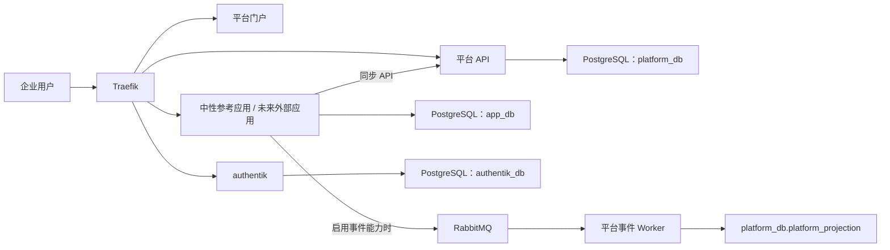

# 企业内部应用平台实施计划

## 1. 文档信息

| 项目 | 内容 |
| --- | --- |
| 文档版本 | V1.6 |
| 文档状态 | 执行基线 |
| 更新日期 | 2026-08-12 |
| 适用范围 | 平台后端、平台管理端、Python SDK、业务中性接入参考应用、API/事件契约、本地与生产部署基线 |
| 上位文档 | [产品设计与实施基线](unified-internal-app-platform-product-and-implementation.md) |
| 推进方式 | 按里程碑和验收门禁推进；不以固定团队规模、固定周数或互联网用户规模改变架构边界 |

本文档把总体方案转换为可执行任务。总体方案负责说明产品、架构和长期边界；本文档负责说明实施顺序、代码位置、依赖、交付物、验证方式和回滚要求。发生冲突时，先更新总体方案或建立 ADR，再调整本文档，不允许由代码实现反向形成未记录的架构事实。

---

## 2. 实施目标与适用场景

目标应用面向企业内部和企业 B 端业务，不以百万级或千万级互联网用户为目标。实施优先级是：

1. 业务数据正确，写入所有权清晰。
2. 身份、权限和操作可审计。
3. 平台、独立应用和共享基础设施的故障边界明确。
4. API 和事件在失败、重试、重复和升级时行为可预测。
5. 部署、备份、恢复、升级和回滚简单且能够演练。
6. 只有经过实际容量或业务价值验证后才增加基础设施和运行能力。

本计划不使用“预计用户会增长”作为微服务、分库分表、Kubernetes、缓存或高可用集群的充分理由。是否启用高可用由业务 SLO、RPO、RTO、合规、容量和故障域决定。

---

## 3. 已冻结实施基线

| 决策 | 实施基线 |
| --- | --- |
| 应用模式 | 第一优先级且默认只实现 `STANDALONE_APP`；业务应用独立项目、构建、部署、数据和回滚 |
| 平台形态 | Python FastAPI 模块化单体；HTTP API 与事件 Worker 使用同一代码包、不同进程和启动入口 |
| 集成边界 | 查询和即时命令优先 API；已经发生的业务事实、不可丢通知和异步协作使用事件 |
| 身份 | authentik 负责凭据、会话和令牌；应用使用 OIDC Discovery/JWKS 在本地验证 JWT |
| 权限 | 平台负责应用级权限、组织范围和授权版本；应用缓存授权结果并在本地执行对象级和业务条件校验 |
| 接入层 | Traefik 只负责 TLS、路由、请求大小和必要基础限流；不建设自研网关或 API 管理平台 |
| 数据库 | 默认一个 PostgreSQL 集群；authentik、平台、平台投影和应用通过逻辑数据库或 Schema、角色和迁移隔离 |
| 事件 | RabbitMQ；至少一次投递、发布确认、手动确认、有限重试和死信；不承诺通用 `EXACTLY_ONCE` |
| 可靠性 | 发布方按需使用本地 Outbox；产生持久化副作用的消费方按需使用本地 Inbox；API-only 应用不创建这些表 |
| 技术栈 | Python 3.14、FastAPI、Pydantic 2、SQLAlchemy 2、psycopg 3、Alembic、uv、Ruff、Pyright、pytest |
| 暂不引入 | Java/JVM 后端、Node.js 后端、微服务拆分、Kubernetes、Redis、Kafka、Elasticsearch、Temporal、通用 BPMN 引擎、自研网关 |
| 后置能力 | 语义目录、SourceBinding、语义查询、搜索、向量索引和 AI 运行能力不进入 M0 至 M4 的关键路径 |

---

## 4. 目标部署形态



图中的三个逻辑数据库默认位于同一个 PostgreSQL 集群。连接账号、迁移和数据所有权必须分离；不得因为物理共用集群而跨数据库或跨 Schema 调用。平台投影是可重建的只读派生数据，不是第二业务主库。

### 4.1 部署档位

| 档位 | 运行组件 | 进入条件 | 不包含 |
| --- | --- | --- | --- |
| 基础接入 | Traefik、authentik、平台 API、门户、PostgreSQL、API-only 独立应用 | 只使用同步 API，允许按维护窗口停机 | RabbitMQ、事件 Worker、Outbox/Inbox、对象存储、完整观测栈 |
| 标准事件 | 基础接入，加 RabbitMQ、应用 Outbox 发布器和需要的消费者 | 存在已登记的可靠事件、异步通知或平台只读投影 | Kafka、通用事件治理平台、所有应用强制事件化 |
| 高可用 | 无状态组件多实例、数据库高可用或托管方案、RabbitMQ 高可用拓扑、独立恢复演练 | 业务 SLO、RPO、RTO、合规或故障域要求已经批准 | 自动微服务拆分、未经测量的容量扩张 |

V0.1 必须验证基础接入和一条标准事件链路，但这不意味着每个业务应用都启用事件能力。正式部署选择哪个档位由应用登记能力和运行目标决定。

M0-04 先冻结 profile 名称、组件选择和生命周期：`base-access` 运行当前可用的 PostgreSQL、基础迁移、平台 API、门户和 API-only 参考应用；`standard-events` 在同一组组件上增加 RabbitMQ。M0-05 再为标准事件档位加入参考应用的可选 Outbox/Inbox 迁移入口。M1-01 把 authentik 与 Traefik 加入两个 profile，M2 再为 `standard-events` 增加事件账号、拓扑和实际 Worker。因此当前完成状态不代表身份链路或事件生产链路已经完成。

---

## 5. 数据库与迁移实施约束

### 5.1 默认逻辑拓扑

| 逻辑存储 | 运行角色 | 迁移归属 | 写入范围 |
| --- | --- | --- | --- |
| `authentik_db` | authentik 专用角色 | authentik 自身 | authentik 内部表 |
| `platform_db` 核心 Schema | 平台 API 角色 | `backend/migrations` | 应用注册、身份映射、权限、通知和审计 |
| `platform_db.platform_projection` | 平台投影 Worker 角色 | `ai_hub_projection_migrator` 通过独立入口迁移 | 投影 Inbox、检查点和已登记类型化投影 |
| `standalone_app_db` | 参考应用角色 | `examples/standalone-app/migrations` | 中性测试记录及按能力启用的本地集成表 |

必须通过数据库权限测试证明：

- 平台 API 角色不能写入应用业务表。
- 独立应用角色不能读取或写入平台核心和平台投影。
- 投影 Worker 角色不能修改来源应用业务状态。
- authentik 角色不能访问平台和应用数据。
- 共用集群不允许共用超级用户作为应用运行账号。

### 5.2 迁移拆分

示例应用迁移必须拆成三类能力：

1. 基础接入迁移：默认执行，只创建中性测试记录表。
2. `EVENT_PUBLISHER` 迁移：按能力启用，只创建 Outbox 及发布索引。
3. `EVENT_CONSUMER` 迁移：按能力启用，只创建 Inbox 或等价幂等记录。

平台投影迁移与平台核心迁移可以位于同一仓库，但必须使用独立 Schema 和清晰的迁移入口。生产启动时不得由 ORM 自动建表，也不得由平台扫描或修改独立应用的迁移记录。

---

## 6. 里程碑与任务清单

任务状态只使用 `待实施`、`进行中`、`已完成`、`阻塞`。只有产物存在且验收通过后才能标记为 `已完成`。

### 6.1 M0：架构与部署基线收敛

目标：让总体文档、仓库结构、部署目标、数据库边界和迁移能力一致。

| 编号 | 任务 | 主要产物 | 依赖 | 状态 |
| --- | --- | --- | --- | --- |
| M0-01 | 更新企业 B 端适用场景、部署档位、权限和事件边界 | 总体方案 V2.1 | 无 | 已完成 |
| M0-02 | 建立独立实施计划 | 本文档 | M0-01 | 已完成 |
| M0-03 | 将本地 Compose 收敛为一个 PostgreSQL 服务和多个逻辑数据库/角色 | `deploy/compose.yaml`、初始化脚本 | M0-01 | 已完成 |
| M0-04 | 增加基础接入与标准事件 Compose profile | Compose 配置、`deploy/README.md` | M0-03 | 已完成 |
| M0-05 | 拆分示例应用基础、Outbox 和 Inbox 迁移 | 示例应用迁移与迁移测试 | M0-03 | 已完成 |
| M0-06 | 明确平台核心与投影 Schema、角色和迁移入口 | 平台迁移、数据库权限测试 | M0-03 | 已完成 |
| M0-07 | 统一环境变量、密钥占位和配置校验 | `.env.example`、Pydantic Settings | M0-03 | 已完成 |
| M0-08 | 锁定生产组件补丁版本或镜像摘要并记录升级策略 | 部署清单、升级说明 | M0-04 | 已完成 |
| M0-09 | 建立基础 CI 门禁 | pytest、Ruff、Pyright、import-linter、迁移和契约校验 | M0-05、M0-06 | 进行中 |

M0 退出条件：

- 本地只运行一个 PostgreSQL 容器即可初始化 authentik、平台和示例应用逻辑数据库或 Schema。
- 平台、平台投影和示例应用迁移可以分别从空环境执行。
- 默认 `API_CLIENT` 示例应用只创建业务表，不创建 Outbox/Inbox，也不启动事件 Worker。
- 数据库角色越权测试通过。
- 文档、Compose、环境变量说明和实际启动命令一致。

### 6.2 M1：身份与 API 纵向链路

目标：独立应用可以通过正式身份协议安全使用平台 API，并且普通请求不逐次依赖身份或权限服务在线可用。

| 编号 | 任务 | 主要产物 | 依赖 | 状态 |
| --- | --- | --- | --- | --- |
| M1-01 | 将 authentik 与 Traefik 加入基础接入部署 | Compose profile、入口和持久化配置 | M0 | 待实施 |
| M1-02 | 配置用户 OIDC Client、服务身份、issuer、audience、scope 和回调白名单 | 可重复初始化的配置或受审计操作说明 | M1-01 | 待实施 |
| M1-03 | 实现 OIDC Discovery/JWKS 获取、缓存和 JWT 本地验证 | 平台和 SDK 身份模块 | M1-02 | 待实施 |
| M1-04 | 实现应用注册、环境入口、健康检查和接入能力登记 | 平台 API、迁移和测试 | M0 | 待实施 |
| M1-05 | 实现用户映射、组织、权限点、授权查询和授权版本 | 平台模块、API 契约和迁移 | M1-03、M1-04 | 待实施 |
| M1-06 | 实现版本化短时授权缓存与对象级授权接口约定 | SDK、示例应用中间件和测试 | M1-05 | 待实施 |
| M1-07 | 实现服务身份调用和最小 scope 校验 | 平台接入模块、SDK 和审计 | M1-02、M1-04 | 待实施 |
| M1-08 | 实现 request_id、结构化日志和接入审计 | 平台与示例应用中间件 | M1-04 | 待实施 |
| M1-09 | 实现测试通知 API 和可观察送达结果 | 通知模块、API 契约和测试替身 | M1-07、M1-08 | 待实施 |
| M1-10 | 完成独立示例应用端到端接入 | 示例应用登录、平台客户端和消费方契约测试 | M1-03 至 M1-09 | 待实施 |

M1 必测场景：

- 正确用户令牌能够访问目标 audience 的 API。
- 错误 issuer、错误 audience、过期令牌、缺少 scope 和被撤销服务凭据被拒绝并产生审计。
- 正常请求只使用本地 JWKS 缓存，不逐次访问 authentik。
- 遇到未知 `kid` 时只刷新一次；刷新失败且无可用密钥时失败关闭。
- authentik 短时不可用时，已缓存密钥对应的有效令牌仍可验证。
- 普通请求使用有效期和版本明确的授权缓存；高风险写操作在授权缓存过期且平台不可用时失败关闭。
- 应用在本地校验对象归属、业务状态和数据范围，平台不接管应用业务规则。
- 平台和示例应用可以分别发布和重启。

M1 退出条件：一个独立应用完成登录、用户令牌验证、当前用户与权限查询、对象级拒绝、服务身份通知调用和审计链路，不共享 Cookie、Session 表、平台源码或数据库账号。

### 6.3 M2：可靠事件纵向链路

目标：用业务中性数据验证一条最小的 Outbox → RabbitMQ → Inbox → 平台只读投影链路。

| 编号 | 任务 | 主要产物 | 依赖 | 状态 |
| --- | --- | --- | --- | --- |
| M2-01 | 配置 RabbitMQ vhost、应用凭据、交换机、队列、死信和最小权限 | 标准事件 profile、配置说明 | M0、M1-07 | 待实施 |
| M2-02 | 收敛 CloudEvents 信封、示例事件和 AsyncAPI 契约 | `contracts/events` | M1-04 | 待实施 |
| M2-03 | 启用参考应用 `EVENT_PUBLISHER` 可选迁移和事务内 Outbox 写入 | 参考应用迁移、中性测试用例和测试 | M0-05、M2-02 | 待实施 |
| M2-04 | 实现应用侧 Outbox 发布器 | 独立启动入口、发布确认、有限重试和指标 | M2-01、M2-03 | 待实施 |
| M2-05 | 实现平台 Inbox、检查点和类型化摘要投影 | 平台投影迁移、Worker 和测试 | M0-06、M2-02 | 待实施 |
| M2-06 | 实现重复、乱序、版本缺口、删除和失败处理 | 幂等策略、重试和错误审计 | M2-04、M2-05 | 待实施 |
| M2-07 | 实现快照水位、对账和从空投影重建的最小接口 | 示例快照契约、重建命令和测试 | M2-05、M2-06 | 待实施 |
| M2-08 | 完成 API-only 与事件应用两种接入契约测试 | 测试矩阵和 CI 门禁 | M2-03 至 M2-07 | 待实施 |

M2 必测场景：

- 来源测试事务回滚时不产生 Outbox 记录；测试记录与 Outbox 同时提交。
- RabbitMQ 不可用时测试事实和 Outbox 保留，发布器恢复后继续发送。
- 发布确认丢失导致重复投递时，平台 Inbox 不重复产生投影副作用。
- 消费者在数据库提交前崩溃时消息重新投递；提交后确认丢失时重复消费仍幂等。
- 旧 `aggregate_version` 不覆盖新投影，版本缺口进入明确状态。
- 投影可以从空 Schema 通过快照水位和后续事件重建。
- 未登记事件能力的应用不能发布或订阅，且无需安装事件表和 Worker。

M2 退出条件：一条已登记事件能够可靠更新平台只读摘要投影，重复、失败、重启和重建测试通过，平台不能通过修改投影改变来源测试记录。

### 6.4 M3：平台公共能力

目标：让平台管理员能够配置和治理公共能力，让应用开发者只依赖公开契约、SDK 和沙箱完成接入；不交付任何真实业务应用。

| 编号 | 任务 | 主要产物 | 依赖 | 状态 |
| --- | --- | --- | --- | --- |
| M3-01 | 完成平台管理端的信息架构、角色任务和验收用例 | 管理端设计、权限矩阵、验收用例 | M1 | 待实施 |
| M3-02 | 实现用户、组织、角色、权限点和数据范围管理 | 平台管理端、API 与自动化测试 | M1、M3-01 | 待实施 |
| M3-03 | 实现应用中心、环境入口、回调、能力集、scope、凭据和版本生命周期管理 | 应用注册管理端、API 与审计 | M1、M3-01 | 待实施 |
| M3-04 | 完成通知配置、测试送达、公共调用审计和查询 | 平台通知与审计管理能力 | M1、M3-01 | 待实施 |
| M3-05 | 完成开发者中心、OpenAPI/AsyncAPI、SDK 示例、沙箱和接入文档 | 开发者入口与版本化文档 | M2、M3-03 | 待实施 |
| M3-06 | 扩展中性参考应用的一致性测试矩阵 | API-only、事件发布、事件消费与投影认证测试 | M2、M3-02 至 M3-05 | 待实施 |
| M3-07 | 由平台管理员、应用开发者、安全和运维角色完成 UAT | UAT 记录、问题清单和发布结论 | M3-02 至 M3-06 | 待实施 |

M3 退出条件：四类平台角色完成主要管理和接入任务；中性参考应用通过 API-only 与事件接入认证；不存在 P0 越权、凭据泄露、数据丢失或契约阻断缺陷；平台代码、数据库、页面和发布制品中不存在真实领域字段、状态机、规则或可写业务表。

### 6.5 M4：生产准备

目标：按照已批准的平台 SLO 完成生产运行和恢复能力，而不是按用户规模堆叠组件。

| 编号 | 任务 | 主要产物 | 依赖 | 状态 |
| --- | --- | --- | --- | --- |
| M4-01 | 确认服务窗口、SLO、RPO、RTO、数据保留和部署档位 | 获批运行目标 | M3 | 待实施 |
| M4-02 | 实现备份、时间点恢复或等价方案并执行恢复演练 | 恢复记录和运行手册 | M4-01 | 待实施 |
| M4-03 | 建立健康检查、基础指标、告警和责任路由 | 监控与告警配置 | M4-01 | 待实施 |
| M4-04 | 完成数据库兼容迁移、灰度、回滚和凭据轮换 | 发布与回滚手册 | M4-01 | 待实施 |
| M4-05 | 执行性能、安全、慢调用、积压、重试风暴和公共依赖故障演练 | 演练报告和整改项 | M4-02 至 M4-04 | 待实施 |
| M4-06 | 根据演练结果决定是否升级高可用档位 | ADR 和容量结论 | M4-05 | 待实施 |

M4 退出条件：恢复、权限、性能、事件积压、凭据撤销和应用故障演练达到已批准目标；告警、升级、备份和回滚都有明确责任与操作步骤。

### 6.6 M5/M6：后续能力

- M5 多消费方治理：使用至少两套彼此独立的消费方配置验证 SDK、脚手架、兼容窗口、凭据隔离和公共能力复用；外部业务应用只作为平台的独立消费者，不是平台交付物。只有出现已批准的跨应用发现、统一搜索或 AI 数据需求时才启动语义目录、SourceBinding 和语义包。
- M6 AI 增强：在数据来源、权限、评测和责任人已经就绪后，选择低风险用例接入模型、知识和受控工具；不反向改变 M0 至 M4 的应用和数据边界。

---

## 7. 契约与配置清单

### 7.1 首批 API 契约

| API | 调用方 | 目的 |
| --- | --- | --- |
| `GET /health/live` | 部署平台 | 判断进程存活，不检查远程依赖 |
| `GET /health/ready` | 接入层 | 判断必要本地依赖是否就绪 |
| `GET /platform-api/v1/me` | 用户请求 | 返回稳定用户 ID、组织摘要和授权版本 |
| `GET /platform-api/v1/me/permissions` | 独立应用 | 返回当前应用权限、数据范围、版本和缓存期限 |
| `POST /platform-api/v1/authorization/decisions` | 明确登记的高风险用例 | 执行需要在线依据的通用授权决策；不代替对象级业务校验 |
| `POST /platform-api/v1/notifications` | 独立应用服务身份 | 发送测试或业务通知并返回可查询状态 |
| `GET /platform-api/v1/applications/{application_id}` | 门户与应用 | 查询登记、入口、健康和接入能力 |

具体路径以 OpenAPI 契约为准。实现前必须先更新 `contracts/api/platform-api.openapi.yaml`，破坏性变更使用新版本而不是原地修改消费方语义。

### 7.2 首批事件契约

首条示例事件采用业务中性名称，例如 `company.example.record.changed.v1`，只用于验证平台接入机制。信封至少包含：

- `event_id`
- `event_type`
- `event_version`
- `source`
- `producer_application_id`
- `subject`
- `aggregate_version`
- `object_type`
- `occurred_at`
- `trace_id`
- `actor`
- `data_classification`
- `data`

`semantic_type` 和 `semantic_version` 是后续语义治理扩展字段，不是 M2 的必填前置条件。

### 7.3 环境配置

M0-07 已冻结以下配置语义和当前前缀；名称调整必须同步更新代码、Compose、示例和部署文档：

| 语义 | 平台进程 | 独立应用进程 | 说明 |
| --- | --- | --- | --- |
| `ENVIRONMENT` | `AI_HUB_ENVIRONMENT` | `STANDALONE_ENVIRONMENT` | `local`、`test`、`integration`、`uat` 或 `production` |
| `APPLICATION_ID` | `AI_HUB_APPLICATION_ID` | `STANDALONE_APPLICATION_ID` | 当前平台或业务应用的稳定登记 ID |
| `PLATFORM_API_BASE_URL` | 不适用 | `STANDALONE_PLATFORM_API_BASE_URL` | 独立应用调用的平台公共 API 地址 |
| `DATABASE_URL` | `AI_HUB_DATABASE_URL` | `STANDALONE_DATABASE_URL` | 仅由对应 API 运行进程读取 |
| 核心迁移连接 | `AI_HUB_MIGRATION_DATABASE_URL` | `STANDALONE_MIGRATION_DATABASE_URL` | 仅由对应 Alembic 进程读取，不进入 API Settings |
| 投影迁移连接 | `AI_HUB_PROJECTION_MIGRATION_DATABASE_URL` | 不适用 | 仅由平台投影 Alembic 进程读取 |
| `OIDC_ISSUER` | `AI_HUB_OIDC_ISSUER` | M1 接入时按受众确定 | authentik issuer，必须精确匹配令牌 |
| `OIDC_AUDIENCE` | `AI_HUB_OIDC_AUDIENCE` | M1 接入时按受众确定 | 当前 API 接受的 audience |
| `RABBITMQ_URL` | M2 事件 Worker 专用 | M2 发布/消费进程专用 | API-only 进程不读取也不要求配置 |

`OIDC_JWKS_CACHE_TTL_SECONDS`、`AUTHORIZATION_CACHE_TTL_SECONDS` 和 `INTEGRATION_CAPABILITIES` 保留为后续任务语义，在实际消费进程出现前不加入当前 Settings。

仓库根 `.env.example` 只服务 Docker Compose，不再混入宿主机连接串；平台和独立应用的宿主机运行示例分别位于 `backend/.env.example` 与 `examples/standalone-app/.env.example`。运行进程、核心迁移、投影迁移使用不同 Settings 模型，任何进程都不因未启用的 RabbitMQ 或其他能力而读取无关配置。

Compose 对所选 profile 的数据库、authentik 和 RabbitMQ 密码使用必填插值，变量缺失或为空时在创建容器前失败。会嵌入数据库 URL 的角色密码必须由足够长度的 URI 非保留字符生成，不能手工做百分号编码。`integration`、`uat` 和 `production` 的 Settings 拒绝本机地址、示例密码以及身份/API 的明文 HTTP 地址；校验错误隐藏输入值，避免连接串密码进入日志。真实密码、Client Secret、数据库密码和 RabbitMQ 凭据不得进入版本库；开发示例值统一标记为 `local-only`，不得用于非本地环境。

### 7.4 生产组件锁

M0-08 的机器可读生产清单位于 `deploy/component-lock.json`，升级和回滚规则位于 `docs/component-upgrade-policy.md`。PostgreSQL、Python、Node.js、Nginx 和 RabbitMQ 均使用“精确标签 + 多架构 OCI index digest”；uv 使用精确版本。Compose、Dockerfile、根 `.env.example` 和清单之间由自动化测试保持一致。

当前锁定基线为 PostgreSQL 18.4、Python 3.14.7、Node.js 24.18.1 LTS、Nginx 1.30.4 stable、RabbitMQ 4.2.9 和 uv 0.9.8。2026-08-12 已在 `linux/arm64` 上用两个独立的全新数据卷完成精确镜像运行验收：迁移、健康、独立应用 API 调用、RabbitMQ 和数据库权限边界均通过。任何版本或摘要变化都必须重跑相同门禁。

---

## 8. 验证命令与质量门禁

M0-09 使用仓库脚本作为唯一命令源，CI 平台只调用这些脚本。开发者本地运行全部基础门禁：

```bash
bash scripts/ci/all.sh
```

三个可独立并行的入口分别是 `scripts/ci/python.sh`、`scripts/ci/frontend.sh` 和 `scripts/ci/deploy.sh`。Python 入口使用 `uv --frozen` 执行 pytest、Ruff、Pyright strict、import-linter、迁移契约、组件锁、公开契约和 CI 自检；前端入口使用 `npm ci` 后执行生产构建；部署入口解析两个 Compose profile。`.github/workflows/ci.yml` 使用 Python 3.14.7、Node.js 24.18.1 和 uv 0.9.8，外部 Action 固定完整提交 SHA，工作流权限只有 `contents: read`，并提供稳定的 `Required gate` 汇总作业供分支保护使用。

当前目录没有 Git 元数据和远端仓库，因此只能验证工作流结构与本地等价入口，尚不能形成远端 Actions 成功记录或配置分支保护。把仓库接入 GitHub 后，必须先确认三个作业与 `Required gate` 实际通过，再将 `Required gate` 配置为受保护分支的必需检查；完成这项外部门禁前 M0-09 保持 `进行中`。

后续实现必须补充：

- 从空数据库执行平台与示例应用迁移的自动化测试。
- 数据库角色越权测试。
- OpenAPI 提供方和 SDK/示例应用消费方契约测试。
- AsyncAPI 和事件载荷 Schema 校验。
- OIDC/JWKS 缓存、未知 `kid`、错误 issuer/audience、过期与撤销测试。
- Outbox 原子提交、Inbox 幂等、重复、重启、积压和投影重建测试。
- 平台和独立应用分别启动、停止、升级与回滚测试。

任何未实际执行的验证不得在交付记录中写为“通过”。如果环境不具备某项验证条件，必须记录原因、风险和进入下一门禁前的补测条件。

---

## 9. 发布、升级与回滚

- 平台、SDK 和独立应用分别版本化；平台发布不得要求所有应用同日升级。
- API 和事件采用先增加、兼容运行、迁移消费方、再删除的演进方式。
- 数据库使用 expand/migrate/contract 策略；破坏性迁移不得与依赖旧结构的应用版本同时发布。
- 应用发布失败时只能回滚自己的制品和迁移策略，不修改平台或其他应用数据库。
- RabbitMQ 故障时，可靠事件保留在应用 Outbox；恢复后有限速地追赶，避免重试风暴。
- 平台权限 API 故障时，低风险读取按版本化缓存约定降级；缓存失效的高风险写入失败关闭。
- authentik 故障时，已缓存 JWKS 对应的有效令牌可以继续本地验证；新登录、未知签名密钥和必须在线撤销的操作按安全策略失败。
- 每次生产发布必须关联制品版本、镜像摘要、迁移版本、契约版本、功能开关和回滚说明。

---

## 10. 当前状态与下一批实施任务

截至本轮实施：

- 总体方案已按企业 B 端、稳定可靠和简单部署目标收敛。
- 平台后端、SDK、独立应用示例、OpenAPI/AsyncAPI 和初始迁移骨架已经存在。
- M0-03 已完成：`deploy/compose.yaml` 只保留一个 PostgreSQL 服务，可从空数据卷初始化 authentik、平台和参考应用三个逻辑数据库。M0-06 增加投影专用迁移账号后，当前共初始化七个受限角色。
- 平台和参考应用迁移已改用独立迁移连接串；空库迁移与数据库/Schema 权限断言已通过。M0-03 至 M0-07 使用本机缓存的 `postgres:16-alpine` 做无下载验证；这类兼容验证不替代 M0-08 的 PostgreSQL 18.4 精确镜像门禁。
- M0-04 已完成：平台 API、门户和参考应用具备容器镜像；`base-access` 与 `standard-events` 的服务集合、迁移依赖、健康检查和启停命令已通过实际验证。
- M0-05 已完成：参考应用基础、`EVENT_PUBLISHER` 和 `EVENT_CONSUMER` 使用三个独立 Alembic 入口及版本表。迁移契约测试通过，并在全新 PostgreSQL 中按“基础 → 发布者 → 消费者”逐级验证：基础只创建 `example_record`，两类可选迁移分别只新增 Outbox 和 Inbox。标准事件档位会执行两类可选迁移，但未提前实现 M2 Worker。
- M0-06 已完成：平台核心与投影使用独立 Alembic 配置、revision、Schema 内版本表和迁移账号。核心空库迁移只建立受保护的版本基线，不再把 Outbox 带入 `base-access`；投影在第二个空库中的独立迁移、完整标准事件档位及数据库所有权/越权断言均已通过。平台 API 对投影只读，投影运行账号不能访问核心，两者均不能修改迁移元数据。
- M0-07 已完成：根 Compose 配置、平台宿主机配置和独立应用宿主机配置已经分离；变量名统一为稳定语义后缀。平台 API、核心迁移、投影迁移、独立应用 API 和独立应用迁移各自只读取所需配置。Compose 会拒绝缺失或空密钥，非本地 Settings 会拒绝本机地址、明文身份/API 地址和 `local-only`/占位密码，校验错误不回显连接串。两个 profile、独立应用到平台的 API 调用和数据库角色边界已在隔离容器中复验。
- M0-08 已完成：已建立 `deploy/component-lock.json` 和组件升级策略，Compose、Dockerfile 与环境模板均使用精确标签和摘要，并把已 EOL 的 Node.js 20 构建基线调整为 Node.js 24 LTS、把门户运行时固定在 Nginx stable。精确镜像核验纠正了一项 Node 标签/摘要错配，并按 PostgreSQL 18 官方目录布局把命名卷挂载点调整为 `/var/lib/postgresql`。两个 profile 已分别从全新数据卷完成迁移、健康、独立应用调用平台、RabbitMQ 和数据库权限审计，实际运行版本与锁清单一致。
- M0-09 进行中：已建立 GitHub Actions 基础工作流、三个可并行的仓库内 CI 入口和一个本地总入口；外部 Action 使用完整提交 SHA，版本与组件锁一致，权限限制为只读。OpenAPI/AsyncAPI/CloudEvents Schema、Python SDK 事件、CI 工作流与脚本自身均已加入契约测试。本地总入口的 36 项测试、Ruff、Pyright strict、import-linter、`npm ci`、前端生产构建和两个 Compose 配置检查已通过；因当前目录没有 Git 远端，仍待远端 Actions 首次成功运行并启用 `Required gate` 分支保护。
- authentik、Traefik、OIDC/JWKS 本地验证和正式权限链路尚未完成。

下一步把当前目录纳入 Git 仓库并关联 GitHub 远端，执行 `.github/workflows/ci.yml`，确认 `Required gate` 成功后将其设为受保护分支必需检查。完成后才能把 M0-09 和整个 M0 标记为 `已完成`；随后从 M1-01 开始身份与 API 纵向链路，M1 未通过前不开始 M2 事件生产链路验收。
